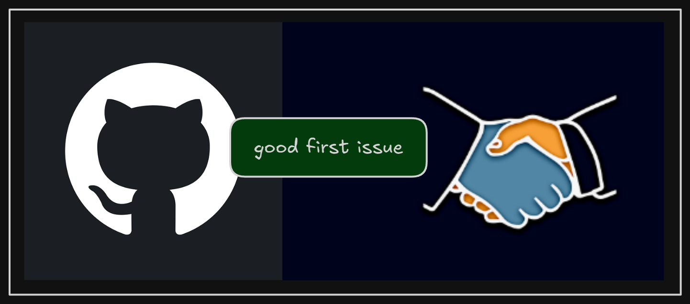

+++
title = "Collaborate on a friend's repo in GitHub."
date = 2025-02-15
updated = 2025-02-15
description = "This weekend, I collaborated on a friend's GitHub repo, adding new features. It was a great opportunity to practice teamwork and version control."

[taxonomies]
tags = ["GitHub"]

[extra]
footnote_backlinks = true
+++

This weekend, I wanted to collaborate on a friend’s repository on GitHub. First, I checked the Issues tab in his repository and found an issue tagged as “good-first-issue”, which means the owner is looking for collaboration on that specific issue.

Next, I wrote a comment on his issue to ask if I could resolve it. He replied yes and assigned the issue to me.

First, I forked the repository, cloned the repository, created a local Git branch and started making changes in it. In my commits, I referenced the issue number. In the last commit, I included the word “closes” to automatically close the issue.

I pushed my branch to the forked repository and selected the new branch in GitHub’s web interface. Then I clicked on the “Contribute” button followed by “Open pull request”.

Finally, GitHub displayed a comparison screen. The left side represents the original repository, where the base branch is usually “main”. On the right side was my fork, showing the new branch with my changes. Then, I proceeded with creating the pull request, which also allowed me to write a message to the owner.
