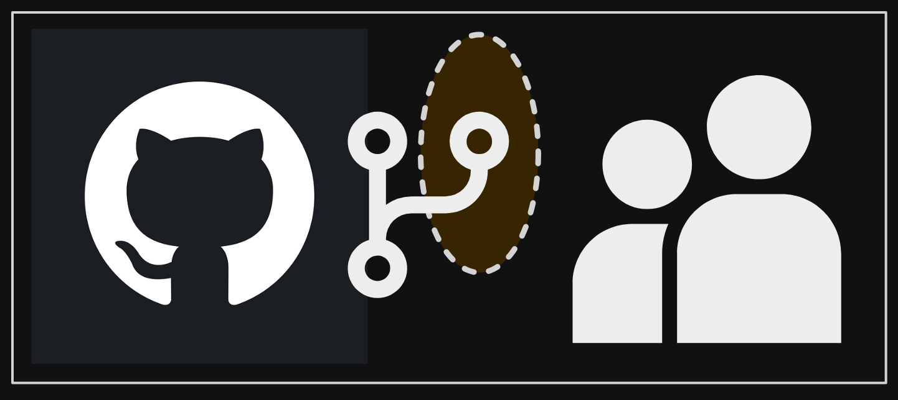

+++
title = "Accessing and reviewing a friend's branch."
date = 2025-02-22
updated = 2025-02-22
description = "I'm collaborating with a friend on his GitHub repository and he asked me to review his work in progress on his branch."

[taxonomies]
tags = ["GitHub"]

[extra]
footnote_backlinks = true
+++

I am contributing to a friend’s repository on GitHub. A few days ago, he told me he was working on a branch and wanted me to look at it to view his progress.

First, I wanted to ensure I didn’t have an upstream repository by using:

`git remote -v`

Next, I added my friend’s original repository as the remote repository with the command:

`git remote add upstream https://github.com/myfriend/originalrepository.git`

Then, I verified that the remote repository was added correctly:

`git remote -v`

To download the most recent information from the original repository, I used:

`git fetch upstream`

Next, I got the specific branch to my fork. First, I executed:

`git checkout -b friend-branch upstream/friend-branch`

And finally, I uploaded the branch to my fork on GitHub with:

`git push origin friend-branch`
