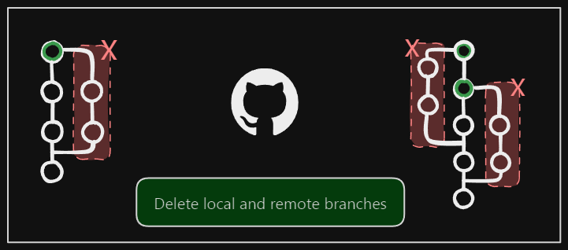

+++
title = "How to delete a branch locally and remotely after it has been merged into main"
date = 2025-03-02
updated = 2025-03-02
description = "I submitted a pull request to my friend's GitHub repository, which they have now merged. As the branch is no longer needed, I would like to delete it."

[taxonomies]
tags = ["Git", "GitHub"]

[extra]
footnote_backlinks = true
+++

I contributed to a friend's repository and created a branch locally, then pushed the branch to my forked repo. My friend accepted the changes, so now I can delete my branch locally:

```bash
git branch -d branch-name
```



Sometimes Git shows a message that it can't delete the branch because it detects that it's not merged, and then suggests that you can force the deletion with the uppercase flag -D instead of -d. However, you must be sure of what you're doing if you use -D to force the deletion:

```bash
git branch -D branch-name
```

If you have several branches to delete, you can use:

```bash
git branch -d branch1 branch2 branch3
```

To delete all local branches that have been merged into the main branch:

```bash
git switch main
git branch --merged | grep -v '\*' | xargs -n 1 git branch -d
```

This command switches to the main branch, list all merged branches, excludes the current branch, and deletes each merged branch.

To delete the branch remotely:

```bash
git push origin --delete branch-name
```

For more advanced users, you can create a Git hook to automatically delete branches after merging. Create a file named post-merge in the .git/hooks directory with the following content:

```bash
#!/bin/sh
BRANCH=$(git symbolic-ref --short HEAD)
if ["$BRANCH" != "main"]; then
    git branch -d $BRANCH
fi
```

This script will delete the branch after merging if it's not the main branch.
