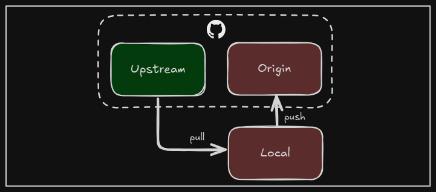

+++
title = "How to synchronize branches in Git"
date = 2025-03-08
updated = 2025-03-08
description = "I share my experience synchronizing branches in GitHub to keep my repository updated with the latest changes"

[taxonomies]
tags = ["Git", "GitHub"]

[extra]
footnote_backlinks = true
+++

As I collaborate on other users’ GitHub repositories, I often need to synchronize the main branch to retrieve the latest changes. Here’s how I do it. To keep my forked repository up-to-date, I follow these steps:



I pull the changes from the main branch of the original repository.

```bash
git pull upstream main
```

After pulling the changes, I push them to my forked repository to ensure it’s updated.

```bash
git push origin main
```

If I need to synchronize a different branch, I use:

```bash
git pull upstream other-branch
```

Sometimes, I want to review changes before merging them into my local branch. Here’s how I do it:

```bash
git fetch upstream
git diff main upstream/main
git merge upstream/main
git push origin main
```

By following these steps, I can keep my forked repository synchronized with the original, ensuring I’m always working with the most up-to-date code.
