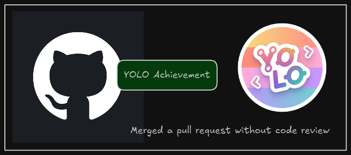

+++
title = "How to obtain the YOLO achievement on GitHub"
date = 2025-03-16
updated = 2025-03-16
description = "The YOLO GitHub achievement is an ironic award that represents a bad practice that users should be aware of and avoid"

[taxonomies]
tags = ["Git", "GitHub"]

[extra]
footnote_backlinks = true
+++

This week, I set out to learn about GitHub's YOLO achievement and how to obtain it. This achievement represents a bad practice that occurs when a user merges a pull request that has been assigned to another reviewer without giving the reviewer time to actually review it.

I attempted to obtain this achievement by following these steps.

1. I chose one of my repositories that I had also cloned on my local computer. In the repository Settings, I went to the Collaborators section and added a GitHub friend. I asked them to accept the invitation, which they did.

2. I created an issue to define a task to resolve (this step is not necessary, but I did it). Next, I created a local branch, referencing the issue number in its name. I made two commits to resolve the issue.

3. Finally, I pushed the new branch and clicked the button to create a pull request in GitHub's interface. On the right side of the screen, I selected my GitHub friend as a reviewer. However, instead of waiting for their review, I immediately merged the pull request.

  <h1 style="background: #556; color: white; padding: 10px; border-radius: 5px; font-size: 1.2em;">
    Getting the YOLO GitHub achievement
  </h1>
  <ul style="padding: 0; margin: 0;"><li style="list-style: none; margin: 5px 0;">
                 Add a collaborator to one of my repositories and wait for them to accept the invitation
               </li><li style="list-style: none; margin: 5px 0;">
                 Create a new branch with some commits to resolve a task
               </li><li style="list-style: none; margin: 5px 0;">
                 Create a pull request and assign the collaborator as a reviewer
               </li><li style="list-style: none; margin: 5px 0;">
                 Merge the pull request immediately without waiting for the collaborator's review
               </li></ul>

