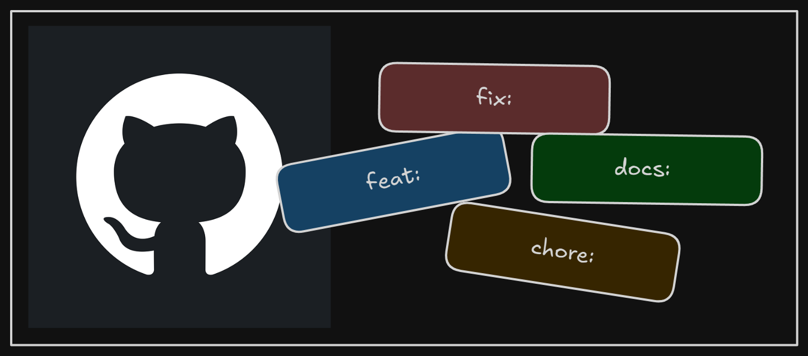

+++
title = "Prefixing Git commits"
date = 2025-03-23
updated = 2025-03-23
description = "Last week, I started adding prefixes to my Git commits to provide more context."

[taxonomies]
tags = ["Git", "GitHub"]

[extra]
footnote_backlinks = true
+++

I recently began incorporating prefixes into my Git commits to add more context to them.

The prefixes I used last week are:

- **feat:** when developing a new feature
- **fix:** for correcting an error
- **chore:** when changing configuration or renaming files
- **test:** for tasks related to testing
- **docs:** when documenting something, for example in the README.md
- **refactor:** for restructuring existing code without changing its external behavior
- **post:** for adding a new blog entry

When I prefix a Git commit, I use lowercase for the prefix, followed by a message that starts with a capitalized letter. Finally, I include a reference to the related issue. For example:

`feat: Show a message to the user indicating successful sign-in (#15)`

I believe this is a good practice, and I've seen it used in other open-source project on GitHub, so I've added it to my workflow. I'll be incorporating more prefixes if I find others that could be useful to me.

  <h1 style="background: #556; color: white; padding: 10px; border-radius: 5px; font-size: 1.2em;">
    Recent Git prefixes used
  </h1>
  <ul style="padding: 0; margin: 0;"><li style="list-style: none; margin: 5px 0;">
                  feat: when developing a new feature
                </li><li style="list-style: none; margin: 5px 0;">
                  fix: for correcting an error
                </li><li style="list-style: none; margin: 5px 0;">
                  chore: when changing configuration or renaming files
                </li><li style="list-style: none; margin: 5px 0;">
                  test: for tasks related to testing
                </li><li style="list-style: none; margin: 5px 0;">
                  docs: when documenting, e.g., in README.md
                </li><li style="list-style: none; margin: 5px 0;">
                  refactor: to restructure code without altering its functionality
                </li><li style="list-style: none; margin: 5px 0;">
                  post: for adding a new blog entry
                </li></ul>

