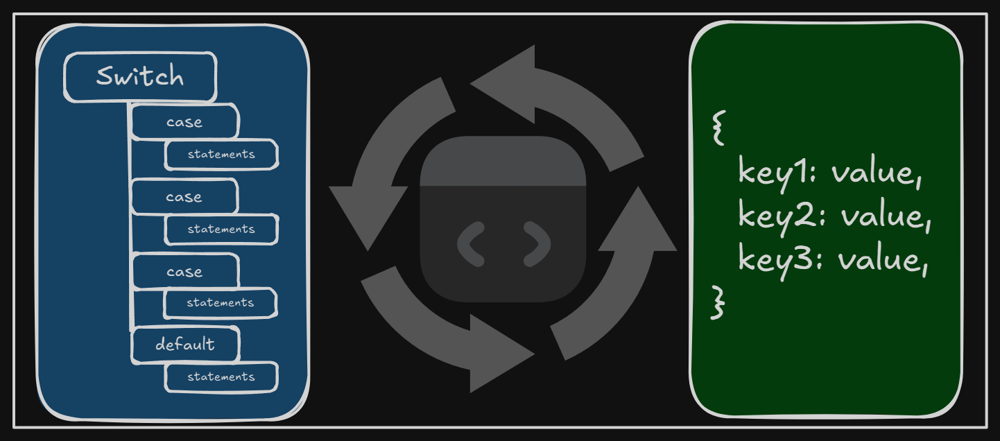

+++
title = "Changing a switch statement to an object-like structure"
date = 2025-03-31
updated = 2025-03-31
description = "A few days ago, I saw a post on LinkedIn about a cool JavaScript refactor, and I wondered if I could apply it to one of my TypeScript projects."

[taxonomies]
tags = ["TypeScript", "Refactor"]

[extra]
footnote_backlinks = true
+++

A few days ago, I saw a post on LinkedIn showcasing a cool JavaScript refactor to convert a switch statement into an object-like structure. This approach reduces the number of lines of code and makes it more readable. I decided to apply it to my GitHub project, [Gif Tower Defense](https://github.com/darellanodev/gif-tower-defense), and refactored some of its switch statements.



Before performing a refactor, I like to have a set of tests covering the code to ensure that I don't break anything after the changes.

Here’s an example of the code before the refactor:

```TypeScript
    switch (direction) {
       case 1:
         return 'ConstDirection.RIGHT'
         break
       case 2:
         return 'ConstDirection.LEFT'
         break
       case 3:
         return 'ConstDirection.DOWN'
         break
       case 4:
         return 'ConstDirection.UP'
         break
       default:
         return 'ConstDirection.LEFT'
         break
     }
```

And this is the code after the refactor:

```TypeScript
    const directionMap = {
       1: 'ConstDirection.RIGHT',
       2: 'ConstDirection.LEFT',
       3: 'ConstDirection.DOWN',
       4: 'ConstDirection.UP',
     }
     return (
       (directionMap as Record<number, string>)[direction] ||
       'ConstDirection.LEFT'
     )
```

I also learned that you can use brackets in object keys to create expressions that evaluate to the returned values. For example:

Here’s the code before refactoring:

```TypeScript
    let canBuy = false

     switch (towerId) {
       case TowerGreen.ID:
         canBuy = this.money >= TowerGreen.COST_UPGRADE[upgradeLevel]
         break
       case TowerRed.ID:
         canBuy = this.money >= TowerRed.COST_UPGRADE[upgradeLevel]
         break
       case TowerYellow.ID:
         canBuy = this.money >= TowerYellow.COST_UPGRADE[upgradeLevel]
         break

       default:
         break
     }

     return canBuy
```

And here’s the equivalent code after the refactor (here you can view the brackets in object keys):

```TypeScript
    const towerCosts = {
       [TowerGreen.ID]: TowerGreen.COST_UPGRADE,
       [TowerRed.ID]: TowerRed.COST_UPGRADE,
       [TowerYellow.ID]: TowerYellow.COST_UPGRADE,
     }
    const cost = towerCosts[towerId]?.[upgradeLevel]

     if (cost === undefined) {
       throw new Error(`Unknown tower id: ${towerId}`)
     }

     return this.money >= cost
```

In [this commit](https://github.com/darellanodev/gif-tower-defense/commit/3dc02a78b23d201ff4441e6237ba0d14d965e218), you can see other changes I made related to this refactor, including the examples mentioned in this post.
