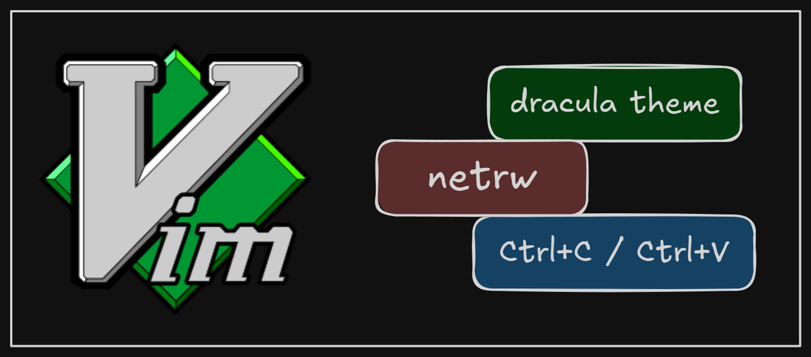

+++
title = "Installing and starting to use Vim with gVim in Windows"
date = 2025-04-05
updated = 2025-04-05
description = "Last year, I started using the Vim extension for VSCode to speed up my coding workflow. Now, in parallel, I want to try gVim on Windows to practice Vim more effectively."

[taxonomies]
tags = ["Vim", "gVim"]

[extra]
footnote_backlinks = true
+++

I've been using the Vim extension for VSCode for the past year and now I want to deepen my knowledge and practice more with Vim by using the gVim application on my Windows system.



First I downloaded and installed gVim from the [official Vim website](https://www.vim.org).

To enable opening gVim from the terminal (Git Bash), I added its path 'C:\Program Files\Vim\vim91\' to the Windows system Path. So then I can open a gitbash terminal in a folder and open the folder with gVim:

```bash
gvim .
```

Next I wanted to increase the font size and change the color scheme. To do this, I cloned the [dracula vim](https://github.com/dracula/vim.git) repository into 'C:\Users\MyUser\vimfiles\pack\themes\start'. (The 'pack' directory didn't exist prior to cloning the repository, so I created this directory and its subdirectories before cloning.)

```bash
mkdir pack
cd pack
mkdir themes
cd themes
mkdir start
cd start
git clone https://github.com/dracula/vim.git dracula
```

Then, I created a \_vimrc file in the C:\Users\MyUser\ folder with the following configuration:

```vim
set nocompatible
syntax enable
set termguicolors
set guifont=Consolas:h14
colorscheme dracula
```

Additionally, I configured netrw (the native file explorer in gVim) to display as a vertical tree with 30% width. Using the leader key (default: \) combined with 'e', I can toggle the tree view.

```vim
let g:netrw_browse_split="v"
let g:netrw_altv=1
let g:netrw_winsize=30
let g:netrw_liststyle=3
nnoremap <Leader>e :Lexplore<CR>
```

Finally, I mapped keys for sharing the Windows clipboard. This allows me to use Ctrl+C to copy selected text from gVim to the Windows clipboard and Ctrl+V to paste text from the clipboard into gVim:

```vim
nnoremap <Leader>e :Lexplore<CR>
vnoremap <C-c> "+y
nnoremap <C-v> "+p
inoremap <C-v> <Esc>"+pa
```
