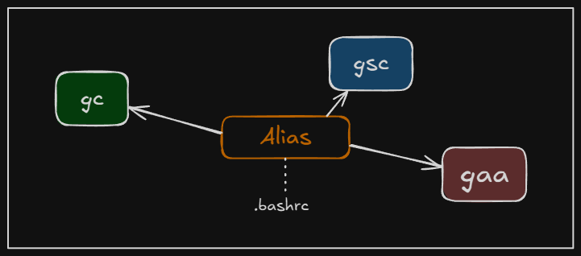

+++
title = "Creating aliases to execute Git commands more effectively."
date = 2025-04-13
updated = 2025-04-13
description = "Last weekend, I reviewed with a friend how we could create aliases on our Windows machines to improve our daily workflow and be more efficient."

[taxonomies]
tags = ["Git", "bash"]

[extra]
footnote_backlinks = true
+++

Last week, I discussed with a friend how we can create simple aliases in Git Bash to make executing Git commands faster and easier. I use Visual Studio Code on my Windows machine, and the default terminal in it is Git Bash.



To start, I opened my user directory by pressing `Win+R` and typing `%USERPROFILE%`.

Next, I created a `.bashrc` file and added the following lines:

```bash
alias gs='git status'
alias gaa='git add --all'
alias gcm='git commit -m'
alias gpl='git pull'
alias gps='git push'
alias amend='git commit --amend --no-edit'
alias amendm='git commit --amend -m'
alias gcb='git checkout -b'
alias gco='git checkout main'
alias gm='git merge'
alias gb='git branch'
alias gbd='git branch -d'
alias gsc='git switch -c'
alias gsm='git switch main'
```

After saving the file, I closed the Git Bash terminal in VSCode and reopened it. Now, when I run the `alias` command, I can see all the aliases listed. If I ever forget an alias, I can simply execute `alias` to view them.

Now I can execute an alias like `gaa` in Git Bash, which runs the command I defined in my `.bashrc` file (`git add --all`), making it easy to stage all changes in the repository.
