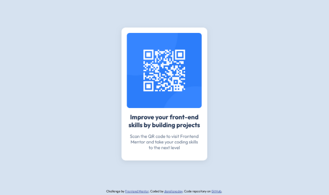

+++
title = "My first project on Frontend Mentor"
date = 2025-05-11
updated = 2025-05-11
description = "Yesterday, I finished my first front-end project on the Frontend Mentor website, and it was a great starting experience."

[taxonomies]
tags = ["Front-end", "Frontend Mentor"]

[extra]
footnote_backlinks = true
+++

Yesterday, I completed my first front-end project proposed on the [Frontend Mentor](https://www.frontendmentor.io) website. I started a newbie path to review things about HTML and CSS, responsiveness, and learn about good practices.

The code of this project is available on [GitHub](https://github.com/darellanodev/fm-projects/tree/main/01-qr-code-component).

The project took me about 5 hours, spread over three days because I didn't want to rush it. My objective is to learn as many good practices as I can and apply them in these exercises.

This first project comes with Figma designs, so it is an opportunity to also learn about how designers work with Figma.

The good practices I tried to apply were:

- Follow BEM conventions to name classes
- Define CSS variables
- Use Prettier to autoformat the code with VSCode
- Take a security precaution using the rel noopener
- Apply Flexbox
- Write media queries for small devices

I also posted it on LinkedIn to share it with the community.

In the next projects, I'll want to apply processes of mobile-first approaches.

I'll keep going with the next projects.
