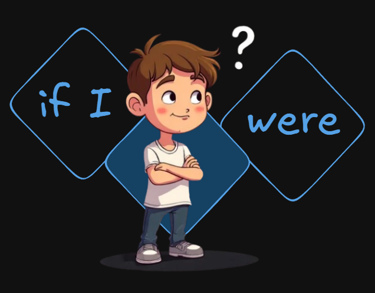

+++
title = "Phrases for unreal or hypothetical situations"
date = 2025-05-31
updated = 2025-05-31
description = "In my progress studying English, I am seeing when I must use 'were' or 'was' depending on whether the phrase is unreal or hypothetical, or a present phrase"

[taxonomies]
tags = ["English"]

[extra]
footnote_backlinks = true
+++

In my course of improving my English, I study unreal or hypothetical phrases and how to use the "were" instead of the "was".

Here are some hypothetical or unreal phrases where you must use the "were" instead of the "was":

- I'd go shopping with you if I weren't so busy
  (This is not true, I am not busy right now)

- If I were rich, I would travel the world
  (In reality, I am not rich)

- If I were you, I would study more
  (I am not you, but I imagine what I would do if I were you)

- If she weren't afraid of dogs, she would have a pet
  (In reality, she is afraid of dogs)

- If we had more time, we could visit Paris
  (In reality, we don't have time, but we imagine this possibility)
