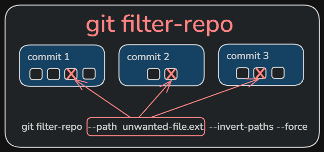

+++
title = "Remove file from Git history"
date = 2026-03-14
updated = 2026-03-14
description = "I share my experience removing a file from Git history using git-filter-repo while keeping the file in the project as untracked"

[taxonomies]
tags = ["Git"]

[extra]
footnote_backlinks = true
+++

## The problem

Imagine you have a file in your project that you never wanted to be part of the Git history. Maybe you added it by mistake in the very first commits, or maybe it was a config file with sensitive info that should never have been tracked.



That happened to me with a file called `prompt.txt`. I added it to the project from the very first commit, and although I always wanted to ignore it, I never set it up correctly in the `.gitignore`. The problem is that even if I added the file to `.gitignore` later, **Git would still track it**.

Every time someone did a `git clone` or checked the project history, they would see that file in the old commits. And that was exactly what I wanted to avoid.

## Why .gitignore alone doesn't work

The `.gitignore` file only tells Git what _new_ files to ignore. If a file was already added in a previous commit, Git will keep tracking it forever, even if it's in `.gitignore`.

To fix this, we need to **rewrite the Git history**. This means changing all existing commits so the file never existed in them.

## The solution: git filter-repo

Git doesn't have a built-in tool for this, but there's an external utility called `git-filter-repo` that is the recommended way to do this today (it's newer than the old `git filter-branch`).

### Step 1: install git filter-repo

The first thing we need is to install this tool. Since it's written in Python, we can use pip:

```bash
pip install git-filter-repo
```

This will download and install the tool so we can use it on our system.

### Step 2: run the cleanup

Once it's installed, we go to our project folder and run:

```bash
git filter-repo --path prompt.txt --invert-paths --force
```

Let's see what each part does:

- `--path prompt.txt`: Tells the tool which file we want to remove from history
- `--invert-paths`: Instead of keeping only that file (which would be the default behavior), we're asking for the opposite: exclude that file from all commits
- `--force`: Forces the execution. Git asks us to do this when it detects we're not on a freshly cloned repo, as a safety measure

## What happens to the remote repository

Here's a crucial point: the remote repository (GitHub, GitLab, etc.) **still has the old history** with the file in it.

If we do a `git push` now, Git will complain because the local and remote histories are different. To upload our changes, we need to force the push:

```bash
git push --force origin main
```

⚠️ **Important warning**: The `git push --force` will rewrite the remote repository's history. This can affect other people working on the project. If there are other collaborators, we should coordinate with them so they clone again after the update.

## When not to do this

- If the project has many active collaborators
- If the repository has a very long history (the process can take a while)
- If there are open pull requests that could be affected

## Conclusion

The command `git filter-repo --invert-paths` is a powerful tool for cleaning up Git history. In my case, it let me remove a file from history while keeping the file in my project as an untracked file.

It's one of those tools you hope you never need, but when you need it, it's a lifesaver. I hope this guide helps if you ever find yourself in a similar situation.
