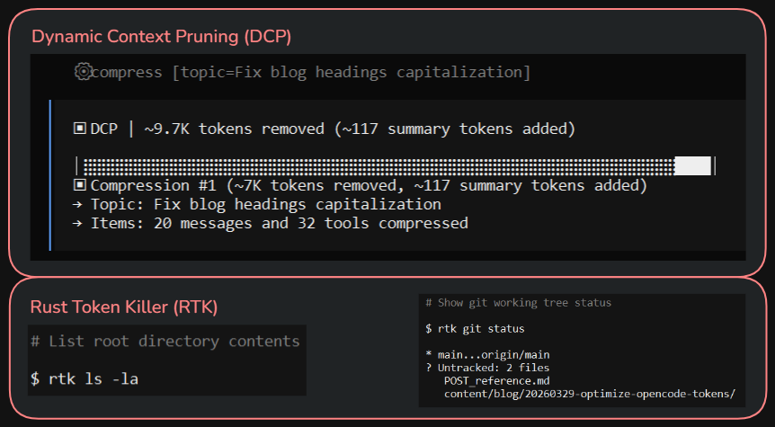

+++
title = "Optimize OpenCode tokens with DCP and RTK"
date = 2026-03-29
updated = 2026-03-29
description = "How to save tokens in OpenCode using Dynamic Context Pruning (DCP) and Rust Token Killer (RTK) - achieve 60-90% reductions in common operations"

[taxonomies]
tags = ["OpenCode", "Tools", "AI"]

[extra]
footnote_backlinks = true
+++

RTK eliminates noise from terminal outputs, achieving 60-90% reductions in common operations.

DCP cleans old information from the context to prevent accumulation of unnecessary messages or results.

In practice, this means fewer tokens per iteration, lighter contexts, and more efficient model usage. This helps make better use of free models and reduce costs on paid ones.



Here are the steps I followed on Windows:

## Updating OpenCode

First, update OpenCode with `choco upgrade opencode` in PowerShell as administrator.

## Installing Dynamic Context Pruning (DCP)

To install DCP, follow the instructions from [Dynamic Context Pruning](https://github.com/Opencode-DCP/opencode-dynamic-context-pruning) (as of this tutorial):

Edit `C:\Users\[MyUser]\.config\opencode\opencode.jsonc` and set:

```json
{
  "plugin": ["@tarquinen/opencode-dcp@latest"]
}
```

Also create a `dcp.jsonc` file and paste the "Default Configuration" from the GitHub repo documentation.

Modify some of these values in `dcp.jsonc` since by default it has high values that might not have any effect on some low-context models:

- "maxContextLimit": 100000, ➡️ ”maxContextLimit": 50000,
- "minContextLimit": 50000, ➡️ ”maxContextLimit": 20000,
- "nudgeFrequency": 5, ➡️ "nudgeFrequency": 1,
- "nudgeForce": "soft", ➡️ "nudgeForce": "strong",
- "iterationNudgeThreshold": 15, ➡️ "iterationNudgeThreshold": 5,

## Installing Rust Token Killer (RTK)

To install RTK, follow the instructions from [Rust Token Killer](https://github.com/rtk-ai/rtk/) (as of this tutorial):

On Windows, download `rtk-x86_64-pc-windows-msvc.zip` from the [releases section](https://github.com/rtk-ai/rtk/releases) of the GitHub repo, extract it and place `rtk.exe` in a fixed path, for example `C:\Programas\rtk\rtk.exe`

In the system environment variables, add the previous path to the "Path" (`C:\Programas\rtk\`)

Open another command prompt and verify with `rtk --version` and `rtk init --show`

Also, with `rtk gain` you can see the saved tokens stats that initially are zero because it hasn't been used yet.

Run `rtk init -g --opencode`

Finally add the RTK plugin to "opencode.jsonc", so the file would look like:

```json
{
  "plugin": ["@tarquinen/opencode-dcp@latest", "@rtk/opencode-plugin@latest"]
}
```

Finally, open OpenCode and press Ctrl+P > View Status (in the System category) and verify that both plugins, dcp and rtk, are visible.

From now on, you can use them and as you have interactions with the agents, these plugins will be used to save tokens.

## Checking token savings

To check token savings in OpenCode, you can run the `/dcp stats` command, and to see savings with rtk, run `rtk gain` in a command prompt.

YouTube video of the process (Spanish audio): [YouTube video](https://youtu.be/68Bs81B4rJg)
