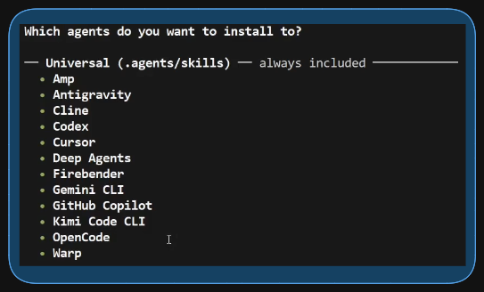
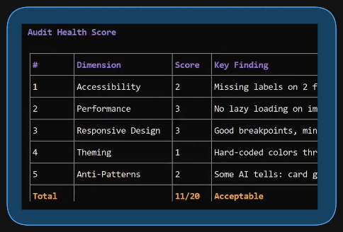
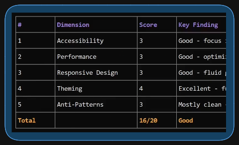

+++
title = "Installing Impeccable skill for OpenCode."
date = 2026-04-10
updated = 2026-04-10
description = "A basic guide to install and use the Impeccable skill in OpenCode to audit and improve web pages."

[taxonomies]
tags = ["OpenCode", "Tools", "AI", "YouTube"]

[extra]
footnote_backlinks = true
+++

I was testing the Impeccable skill in OpenCode to improve the design of a website, taking into account aspects such as accessibility, responsive design, and antipatterns. I really liked it and wanted to share it with the community. I hope to apply it to more personal projects to keep improving my web designs.

Below, I'll show you how to install the Impeccable skill for OpenCode.

We start in a terminal in the project directory where we want to use this skill.

First, we go to the GitHub repo [pbakaus/impeccable](https://github.com/pbakaus/impeccable) and open the website linked there ([impeccable.style](https://impeccable.style/)). In "Get Started", we go to the section that shows the npx command to install it.

In the terminal of the project directory, we run:

- `npx skills add pbakaus/impeccable`

We follow the installer instructions, select all skills, and then a question appears asking if we want to install any AI agent not in the universal installation list. Since OpenCode is already supported, we just press Enter to continue.

After installing it, we open OpenCode and run the /audit command. In my case, I had an index.html that I wanted to audit, so I ran `/audit index.html`

OpenCode runs the skill, and after a while, it presents a report with different areas, scores, and suggestions for improvement.

Next, we run the combined commands `/normalize /polish` and press Enter. After a while, the corrections are applied to the web design.

Finally, we run `/audit index.html` to see if the score improved after the corrections.

You can watch the process in [this video](https://youtu.be/n8jSHo_PQbM) (Spanish audio).

{{ youtube_embed(video_id="n8jSHo_PQbM") }}
