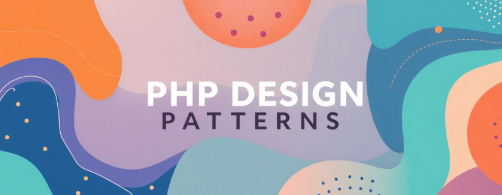

+++
title = "A PHP app to practice design patterns"
date = 2026-04-25
updated = 2026-04-25
description = "I share how I built a PHP app to practice design patterns using AI"

[taxonomies]
tags = ["PHP", "OOP", "Design Patterns"]

[extra]
footnote_backlinks = true
+++



I wanted to create a new PHP app to practice design patterns. I used AI to help me build the base. Let me share how I did it.

## The first step

First, I made sure I had PHP 8.2.12 on my computer. Then I wrote a Prompt.md file with all my requirements:

- Use PHP 8.2.12
- Use composer autoload
- Use OOP with classes in the `src` folder
- Use Git with conventional commits
- Put examples in the `examples` folder
- Use Tailwind CSS for the frontend

I used OpenCode with Minimax (a free AI model) to read my prompt and build the base for me.

## Folder structure

I wanted a clean structure. I made two main folders:

- `src` - for my PHP classes
- `examples` - for code that uses my classes

```text
examples
    - structural
        - adapter
            - audio_player

src
    - Structural
        - Adapter
            - AudioPlayer
```

The AI created all this for me following my prompt. The `src` folder has all my classes. The `examples` folder has code that shows how to use them.

I also have an `index.php` in the root folder. It shows all the examples I have.

## Using good practices

I used object-oriented programming from the start. Each class has one job. I used the adapter pattern as an example.

For the visual part, I used Tailwind CSS. It is simple and looks good.

## Git commits

I use Git for version control. I write clear commit messages using conventional commits:

- `feat:` for new features
- `refactor:` for improvements
- `fix:` for bug fixes

The AI proposes commit messages for me. This keeps my history clean.

This setup gives me a good base to practice design patterns in PHP. Simple code, clear structure, and easy to maintain.

You can see the process I followed in [this video](https://youtu.be/gSCB-Q1-cVg) (Spanish audio).
