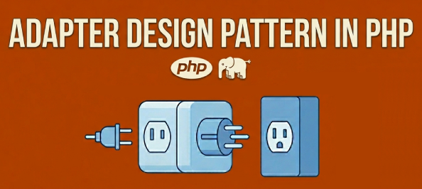

+++
title = "PHP Adapter Design Pattern"
date = 2026-05-07
updated = 2026-05-07
description = "A clear guide to the Adapter pattern in PHP, showing how to add new features by adapting external library code without modifying the library itself"

[taxonomies]
tags = ["PHP", "OOP", "Design Patterns"]

[extra]
footnote_backlinks = true
+++

We look at the Adapter pattern with a PHP example that we created using AI in the previous video. The example shows a music player where we want to add support for more formats using an external library, but we cannot modify that library code.



## Step 1: Starting point

We have a class with a play method that plays MP3 and WAV files. For learning purposes, it just returns a string showing what would play (instead of real audio code).

```php
class AudioPlayer
{
    public function play(string $audioType, string $filename): string
    {
        if ($audioType === 'mp3') {
            return "Playing MP3 file: {$filename}";
        } elseif ($audioType === 'wav') {
            return "Playing WAV file: {$filename}";
        }
        return "Unsupported format: {$audioType}";
    }
}

// Usage
$player = new AudioPlayer();
echo $player->play('mp3', 'song.mp3'); // Output: Playing MP3 file: song.mp3
```

## Step 2: The new requirement

Now we need to support MP4 and MKV formats. These come from an external library, and we cannot modify that library code:

```php
// External library - we cannot modify it

// interfaces
interface Mp4PlayerInterface {
    public function playMp4(string $filename): string;
}
interface MkvPlayerInterface {
    public function playMkv(string $filename): string;
}

// classes
class Mp4Player implements Mp4PlayerInterface {
    public function playMp4(string $filename): string {
        return "Playing MP4 file: {$filename}";
    }
}
class MkvPlayer implements MkvPlayerInterface {
    public function playMkv(string $filename): string {
        return "Playing MKV file: {$filename}";
    }
}
```

## Step 3: Create a common interface

First, we create a MediaPlayer interface with a play method that will be the shared rule:

```php
interface MediaPlayer {
    public function play(string $audioType, string $filename): string;
}
```

## Step 4: Make AudioPlayer implement the interface

Update AudioPlayer to use the MediaPlayer interface with the play method it already has:

```php
class AudioPlayer implements MediaPlayer {
    public function play(...) { ... }
}
```

## Step 5: Create the adapter

Now we create the adapter, which is a MediaAdapter class that follows the MediaPlayer interface:

```php
class MediaAdapter implements MediaPlayer
{
    private Mp4PlayerInterface|MkvPlayerInterface $advancedPlayer;

    public function __construct(string $audioType)
    {
        if ($audioType === 'mp4') {
            $this->advancedPlayer = new Mp4Player();
        } elseif ($audioType === 'mkv') {
            $this->advancedPlayer = new MkvPlayer();
        }
    }

    public function play(string $audioType, string $filename): string
    {
        if ($audioType === 'mp4' && $this->advancedPlayer instanceof Mp4PlayerInterface) {
            return $this->advancedPlayer->playMp4($filename);
        } elseif ($audioType === 'mkv' && $this->advancedPlayer instanceof MkvPlayerInterface) {
            return $this->advancedPlayer->playMkv($filename);
        }
        return '';
    }
}
```

## Step 6: AudioPlayer delegates to MediaAdapter

Now AudioPlayer uses the MediaAdapter to handle MP4 and MKV formats, while still handling MP3 and WAV directly:

```php
class AudioPlayer implements MediaPlayer {
    private MediaAdapter $adapter;

    public function play(string $audioType, string $filename): string {
        if (in_array($audioType, ['mp3', 'wav'])) {
            return "Playing {$audioType} file: {$filename}";
        } elseif (in_array($audioType, ['mp4', 'mkv'])) {
            $this->adapter = new MediaAdapter($audioType);
            return $this->adapter->play($audioType, $filename);
        }
        return "Unsupported audio type: {$audioType}";
    }
}
```

## Conclusion

With this pattern, we can add new features without touching the external library code. The Adapter pattern helps us connect pieces that have different ways of working.

You can see the process I followed in [this video](https://youtu.be/gSCB-Q1-cVg) (Spanish audio).

{{ youtube_embed(video_id="J8qIpDB2510") }}
