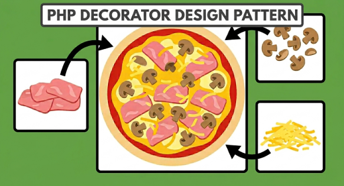

+++
title = "Decorator pattern with pizzas"
date = 2026-05-13
updated = 2026-05-13
description = "We practice the Decorator pattern in a pizzeria to add ingredients dynamically, without creating a class for each possible combination"

[taxonomies]
tags = ["PHP", "OOP", "Design Patterns"]

[extra]
footnote_backlinks = true
+++

Hello developer 👋 In this post, we're going to practice the Decorator pattern in a pizzeria 🍕 to add ingredients dynamically, without creating a class for each possible combination.



🍕 Act 1 — The starting point

As developers, we've created an application to manage a pizzeria. For now, it's very simple and we only have a Pizza class that represents the only pizza sold, which gives us its description (Simple pizza) and its cost (5 euros):

```php
class Pizza
{
    public function getDescription(): string
    {
        return 'Simple pizza';
    }

    public function getCost(): float
    {
        return 5.00;
    }
}

$pizza = new Pizza();
echo $pizza->getDescription(); // Simple pizza
echo $pizza->getCost(); // 5.00
```

💥 Act 2 — The problem grows

The business grows and the owner wants to offer extra ingredients. Our first idea as developers is to create a subclass for each variant, but with just 2 ingredients, 3 classes already appear. Adding more ingredients escalates the combinations: the code becomes unmanageable.

```php
class PizzaWithCheese extends Pizza
{
    public function getDescription(): string
    {
        return 'Simple pizza, cheese';
    }

    public function getCost(): float
    {
        return parent::getCost() + 1.50;
    }
}

class PizzaWithHam extends Pizza
{
    public function getDescription(): string
    {
        return 'Simple pizza, ham';
    }

    public function getCost(): float
    {
        return parent::getCost() + 2.00;
    }
}

class PizzaWithCheeseAndHam extends Pizza
{
    public function getDescription(): string
    {
        return 'Simple pizza, cheese, ham';
    }

    public function getCost(): float
    {
        return parent::getCost() + 1.50 + 2.00;
    }
}

// ... and we keep creating classes 😰
```

💡 Act 3 — The revelation

Let's better apply the Decorator pattern, which allows us to wrap a pizza with ingredients dynamically, without creating new subclasses.

```php

// 1. Common interface
interface PizzaInterface
{
    public function getDescription(): string;
    public function getCost(): float;
}

// 2. Base pizza
class SimplePizza implements PizzaInterface
{
    public function getDescription(): string { return 'Simple pizza'; }
    public function getCost(): float { return 5.00; }
}

// 3. Abstract decorator
abstract class PizzaDecorator implements PizzaInterface
{
    public function __construct(protected PizzaInterface $pizza) {}

    public function getDescription(): string { return $this->pizza->getDescription(); }
    public function getCost(): float { return $this->pizza->getCost(); }
}

// 4. Concrete decorators
class CheeseDecorator extends PizzaDecorator
{
    public function getDescription(): string { return $this->pizza->getDescription() . ', cheese'; }
    public function getCost(): float { return $this->pizza->getCost() + 1.50; }
}

class HamDecorator extends PizzaDecorator
{
    public function getDescription(): string { return $this->pizza->getDescription() . ', ham'; }
    public function getCost(): float { return $this->pizza->getCost() + 2.00; }
}
```

`PizzaDecorator` is abstract for two reasons:

1. It doesn't make sense to instantiate it alone; we always need a concrete decorator like `CheeseDecorator`.
2. It centralizes the common logic: the constructor that receives the pizza and the delegation of `getDescription()` and `getCost()`. So each concrete decorator only writes what it adds, without repeating code.

`PizzaInterface` is the contract that ensures that everything that goes into a decorator — whether it's the base pizza or another decorator — will always have the same methods. Without that contract, we couldn't nest decorators.

✅ Act 4 — The result

```php

$pizza = new SimplePizza();
$pizza = new CheeseDecorator($pizza);
$pizza = new HamDecorator($pizza);

echo $pizza->getDescription(); // Simple pizza, cheese, ham
echo $pizza->getCost();        // 8.50
```

🎯 Act 5 — Conclusion

Thanks to the Decorator pattern, we've gone from needing a class for each possible combination, to needing only one class per ingredient. Adding a new ingredient is as simple as creating another decorator, without touching anything existing.

```php
class PepperoniDecorator extends PizzaDecorator
{
    public function getDescription(): string { return $this->pizza->getDescription() . ', pepperoni'; }
    public function getCost(): float { return $this->pizza->getCost() + 1.80; }
}
```

You can watch the video of the process here:

{{ youtube_embed(video_id="uEfenDpLMCo") }}
