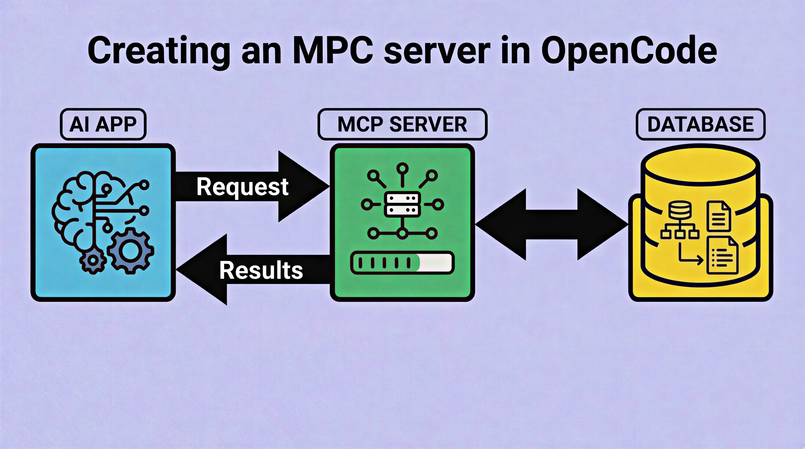

+++
title = "Create MCP SQLite server for OpenCode"
date = 2026-05-18
updated = 2026-05-18
description = "Learn how to create a simple MCP server with TypeScript and SQLite, then connect it to OpenCode for natural language database queries"

[taxonomies]
tags = ["OpenCode", "TypeScript", "Tools", "AI", "YouTube"]

[extra]
footnote_backlinks = true
+++

In this post, I'll show you how to create a simple MCP server with TypeScript and SQLite, and then connect it to OpenCode to query your database using natural language.



## What is MCP

MCP (Model Context Protocol) is a protocol that allows AI tools to interact with external resources. In this case, we'll create a server that lets OpenCode query a SQLite database.

## Creating the project

The project structure includes:

- database.sqlite - the SQLite database
- seed.ts - script to populate the database with sample data
- src/index.ts - MCP server entry point
- src/db.ts - database connection
- src/tools/queries.ts - pure functions for queries

The database has three tables: productos (products), clientes (clients), and pedidos (orders).

## Available tools

The MCP server exposes four tools:

- list_tables - lists available tables
- describe_table - shows table structure
- execute_query - runs SQL queries (with validation)
- get_summary - returns store summary

## Connecting to OpenCode

Create an opencode.json file with the absolute path to your MCP:

```json
{
  "mcpServers": {
    "mcp-sqlite": {
      "command": "node",
      "args": ["path/to/mcp-sqlite/dist/index.js"]
    }
  }
}
```

Now you can ask OpenCode natural language queries like:

- "What tables do I have?"
- "Show me all products"
- "Which client has spent the most?"

In the following video you can see the complete process (Spanish audio).

{{ youtube_embed(video_id="shBY1RWAFOw") }}
