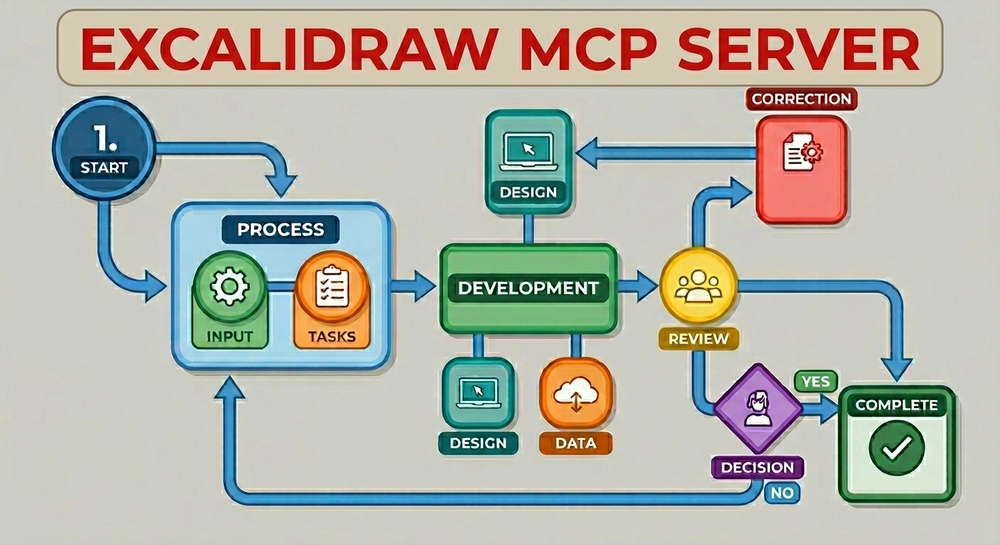

+++
title = "Creating diagrams with Excalidraw MCP"
date = 2026-05-24
updated = 2026-05-24
description = "How to set up and use the Excalidraw MCP server with OpenCode to create architecture diagrams with AI"

[taxonomies]
tags = ["OpenCode", "TypeScript", "Tools", "AI", "YouTube"]

[extra]
footnote_backlinks = true
+++

I recently tried the Excalidraw MCP server to create architecture diagrams using AI with OpenCode. The result is fully editable and can be viewed directly inside VSCode. Here's how to set it up.



## Setting up the MCP server

First, check the documentation at [mcp-excalidraw](https://mcpservers.org/servers/yctimlin/mcp_excalidraw). Then clone and build the server:

```bash
git clone https://github.com/yctimlin/mcp_excalidraw.git
cd mcp_excalidraw
npm ci
npm run build
HOST=0.0.0.0 PORT=3000 npm run canvas
```

The canvas runs on `http://localhost:3000/`, so you can also test it in your browser.

## Configuring OpenCode

In your project, create or edit `opencode.json` to register the MCP:

```json
{
  "$schema": "https://opencode.ai/config.json",
  "mcp": {
    "excalidraw": {
      "type": "local",
      "command": ["node", "C:/path/to/mcp_excalidraw/dist/index.js"],
      "enabled": true,
      "environment": {
        "EXPRESS_SERVER_URL": "http://127.0.0.1:3000",
        "ENABLE_CANVAS_SYNC": "true"
      }
    }
  }
}
```

## Verifying and using it

Open OpenCode and run `/mcps` to confirm the Excalidraw MCP is installed and enabled. Then you can ask it to create a diagram:

> Make me a diagram of the structure or architecture of this repository with Excalidraw

The result can be viewed and edited in real time at `http://127.0.0.1:3000`. From there you can download it as an `.excalidraw` file and open it with the [Excalidraw VSCode extension](https://marketplace.visualstudio.com/items?itemName=pomdtr.excalidraw-editor).

## Video

In the following video you can see the complete process (Spanish audio).

{{ youtube_embed(video_id="w_bl-ON3R8Y") }}
