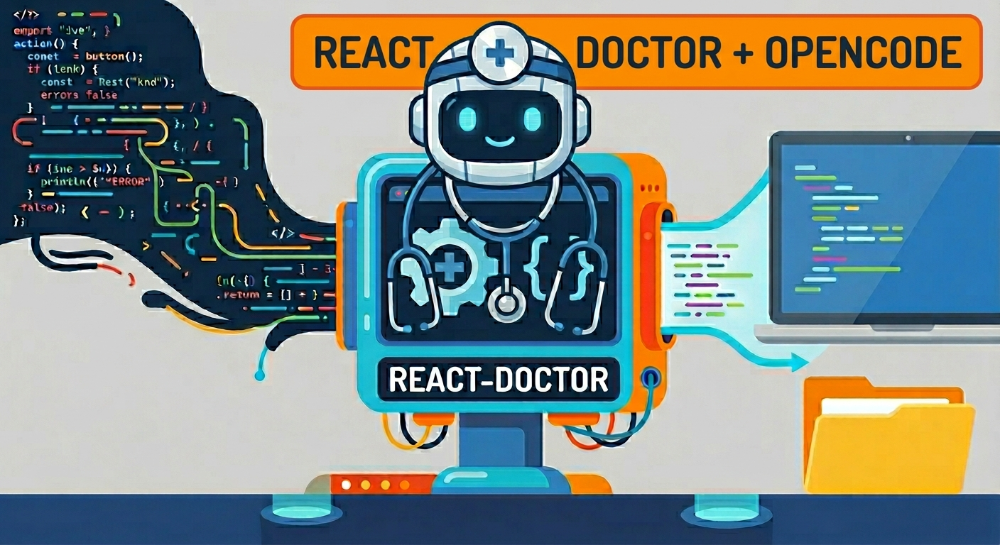

+++
title = "React Doctor with OpenCode"
date = 2026-05-31
updated = 2026-05-31
description = "Using React Doctor for a deterministic analysis of a React project, then installing the react-doctor skill in OpenCode to fix issues with AI"

[taxonomies]
tags = ["OpenCode", "React", "AI", "Tools", "YouTube"]

[extra]
footnote_backlinks = true
+++

Hi developer 👋 in the following video we use React Doctor to analyze a React project. Then we install the react-doctor skill in OpenCode to help us fix the problems with AI. Finally, we run the audit again to see if the score improved.



## Documentation

Check the documentation on [GitHub](https://github.com/millionco/react-doctor).

## Run the audit

First, run the deterministic audit in the project root:

```bash
npx react-doctor@latest
```

For everyday use, if you want to check only your changes and not the whole project:

```bash
npx react-doctor@latest --verbose --diff
```

## Run the fix with AI agents

```bash
npx react-doctor@latest install
```

Do not select any extra agents. If OpenCode does not show up, try installing this skill from: <https://www.skills.sh/posthog/posthog/react-doctor>

## Prompt in OpenCode

```
/react-doctor In the tmp-react-doctor directory I left some audit files from the react-doctor tool. Use the react-doctor skills to fix issues. For now, do not do dangerous things like deleting files. Do not run the react-doctor analyzer, I will do that myself. Just fix what I indicated based on the audit files.
```

## CI with GitHub Actions

There is also a tool for CI with GitHub Actions:

<https://github.com/marketplace/actions/react-doctor>

## Video

In the following video you can see the complete process (Spanish audio).

{{ youtube_embed(video_id="Hum69TRE8H0") }}
