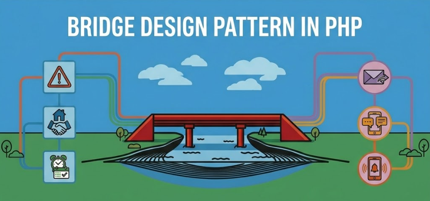

+++
title = "Bridge pattern for notifications in PHP"
date = 2026-06-07
updated = 2026-06-07
description = "We practice the Bridge pattern in PHP to separate notification types from delivery channels, avoiding class explosion when adding new features"

[taxonomies]
tags = ["PHP", "OOP", "Design Patterns", "YouTube"]

[extra]
footnote_backlinks = true
+++

Hello developer 👋 In this post we practice the Bridge pattern in PHP through a notification application that sends messages across different channels. This pattern allows us to extend two dimensions separately: what type of notification we want to send and which channel sends it ✨



🚀 Act 1 — The beginning of the application

As developers, we need to create an application to send notifications. For now, the system only needs to send messages by email, so we start with a simple solution.

To keep things simple, we use a return string to simulate all the code needed.

```php
class EmailNotification
{
    public function send(string $message): string
    {
        return "Sending by email: {$message}\n";
    }
}

// Client code
$notification = new EmailNotification();
echo $notification->send("Server is down");
```

📬 Act 2 — A new need appears

Soon after, we need the application to also send notifications by SMS. If we follow the previous approach, we create another class for this new channel.

```php
class EmailNotification
{
    public function send(string $message): string
    {
        return "Sending by email: {$message}\n";
    }
}

class SmsNotification
{
    public function send(string $message): string
    {
        return "Sending by SMS: {$message}\n";
    }
}

// Client code
$email = new EmailNotification();
echo $email->send("Server is down");

$sms = new SmsNotification();
echo $sms->send("Meeting at 5 PM");
```

📈 Act 3 — The system starts to grow

Later, the business asks for different types of notifications. Now we have not only normal messages, but also alerts, reminders, and welcome messages.

If we also want to keep supporting multiple channels, many combinations start to appear.

```php
class AlertEmailNotification
{
    public function send(string $message): string
    {
        return "[ALERT] Sending by email: {$message}\n";
    }
}

class AlertSmsNotification
{
    public function send(string $message): string
    {
        return "[ALERT] Sending by SMS: {$message}\n";
    }
}

class ReminderEmailNotification
{
    public function send(string $message): string
    {
        return "[REMINDER] Sending by email: {$message}\n";
    }
}

class ReminderSmsNotification
{
    public function send(string $message): string
    {
        return "[REMINDER] Sending by SMS: {$message}\n";
    }
}
```

⚠️ Act 4 — The problem becomes clear

As we add more notification types and more delivery channels, the number of classes grows too much. Each new combination forces us to create a new class, and that makes the design hard to maintain.

```php
class WelcomeEmailNotification
{
    public function send(string $message): string
    {
        return "[WELCOME] Sending by email: {$message}\n";
    }
}

class WelcomeSmsNotification
{
    public function send(string $message): string
    {
        return "[WELCOME] Sending by SMS: {$message}\n";
    }
}
```

🔧 Act 5 — We apply Bridge

To avoid this class explosion, we apply the Bridge pattern. Bridge separates two dimensions that change independently: the notification type and the delivery channel.

For the channels:

```php
interface NotificationChannel
{
    public function send(string $message): string;
}

class EmailChannel implements NotificationChannel
{
    public function send(string $message): string
    {
        return "Sending by email: {$message}\n";
    }
}

class SmsChannel implements NotificationChannel
{
    public function send(string $message): string
    {
        return "Sending by SMS: {$message}\n";
    }
}

class PushChannel implements NotificationChannel
{
    public function send(string $message): string
    {
        return "Sending by push: {$message}\n";
    }
}
```

For the notifications:

```php
abstract class Notification
{
    protected NotificationChannel $channel;

    public function __construct(NotificationChannel $channel)
    {
        $this->channel = $channel;
    }

    abstract public function notify(string $text): string;
}

class AlertNotification extends Notification
{
    public function notify(string $text): string
    {
        return $this->channel->send("[ALERT] {$text}");
    }
}

class ReminderNotification extends Notification
{
    public function notify(string $text): string
    {
        return $this->channel->send("[REMINDER] {$text}");
    }
}

class WelcomeNotification extends Notification
{
    public function notify(string $text): string
    {
        return $this->channel->send("[WELCOME] {$text}");
    }
}
```

🎯 Act 6 — The client uses both parts

Now we can combine any notification type with any channel without multiplying classes. The abstraction decides what message is sent, and the implementor decides how it is sent.

```php
$alertByEmail = new AlertNotification(new EmailChannel());
echo $alertByEmail->notify("Server is down");

$reminderBySms = new ReminderNotification(new SmsChannel());
echo $reminderBySms->notify("Meeting at 5 PM");

$welcomeByPush = new WelcomeNotification(new PushChannel());
echo $welcomeByPush->notify("New user registered");
```

You can see the process I followed in [this video](https://youtu.be/xzHdSNMW0y0) (Spanish audio).

{{ youtube_embed(video_id="xzHdSNMW0y0") }}

Bridge separates what is sent from how it is sent. This gives us a more flexible, cleaner structure that is much easier to extend.
