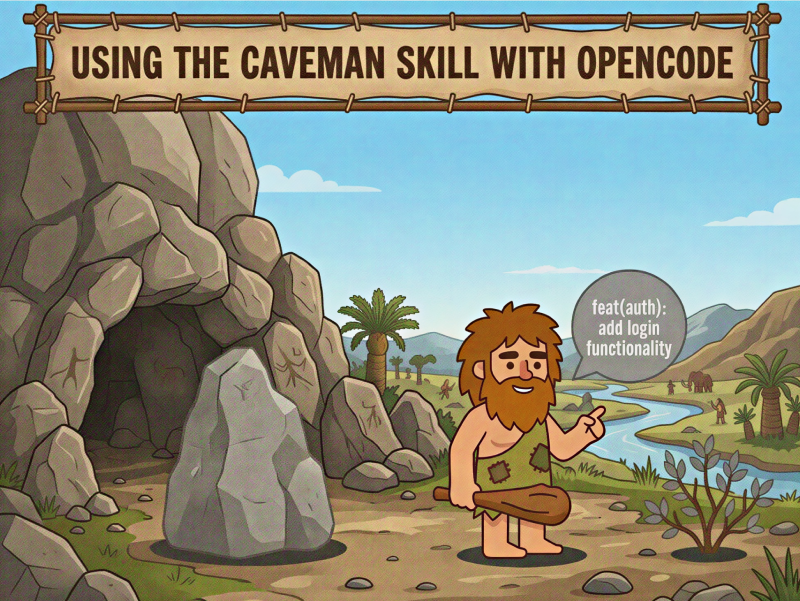

+++
title = "Caveman skill with OpenCode"
date = 2026-06-11
updated = 2026-06-11
description = "Testing the Caveman skill for OpenCode to make AI agents respond more concisely and reduce token output without losing technical precision"

[taxonomies]
tags = ["OpenCode", "AI", "Tools", "YouTube"]

[extra]
footnote_backlinks = true
+++

Hi developer 👋 in the following video we test the Caveman skill with OpenCode. The idea is to make the agent respond more briefly, reducing token output without losing technical precision. We also test compressing natural language in files, reviewing code, and generating short commit messages.



## Installation

First, install the Caveman skill in the project:

```bash
npx skills add JuliusBrussee/caveman -a opencode
```

Select all the skills it offers. Caveman is simply an instruction to the LLM that says "respond telegraphically, no filler". The LLM follows that instruction regardless of the language being used.

## File compression

Test file compression with:

```
/caveman-compress AGENTS.md
```

It creates a backup `AGENTS.original.md` and compresses natural text without touching code blocks, URLs, or important technical terms. If satisfied, delete the backup. Git also allows you to revert.

## Activating caveman lite

There are 4 modes available. Activate the lite mode:

```
/caveman lite
```

It activates for the session. You can also modify `AGENTS.md` to auto-start caveman in lite mode.

## Testing plan and build modes

In Plan mode, ask for a code review:

```
In src/DoorManager.ts the use of player.isLocked is confusing since locked sounds like blocked. Could we use a term like isMouseCaptured?
```

The output should be more concise. Switch to Build mode and ask to implement the change. Observe the response style.

## Code review

Run a full review of the project:

```
/caveman-review review the project code
```

The feedback includes nits — comments of little importance that don't affect functionality or security.

## Fix issues and commit

Correct an issue from the review and commit with:

```
/caveman-commit
```

It uses [Conventional Commits](https://www.conventionalcommits.org/en/v1.0.0/) conventions.

## Video

In the following video you can see the complete process (Spanish audio).

{{ youtube_embed(video_id="z7nlA9aMVZU") }}
