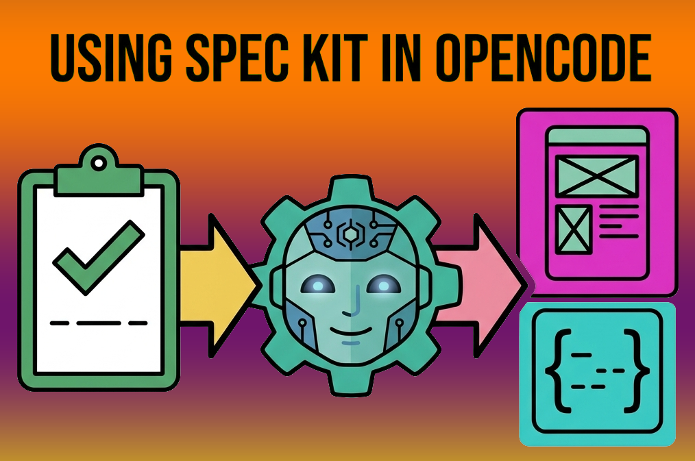

+++
title = "Spec-Driven Development with OpenCode and Spec Kit"
date = 2026-06-17
updated = 2026-06-17
description = "I explore Spec-Driven Development using GitHub Spec Kit and OpenCode AI agents to build a CLI flashcard app called study-cards-cli"

[taxonomies]
tags = ["OpenCode", "AI", "YouTube", "SDD"]

[extra]
footnote_backlinks = true
+++

We build a mini application called `study-cards-cli`, designed to review theoretical concepts from the terminal using a Markdown file. It works like a flashcard app.



## Installing Spec Kit

First install [UV](https://docs.astral.sh/uv/getting-started/installation/#standalone-installer), a Python package manager. On Windows, run this in PowerShell:

```powershell
powershell -ExecutionPolicy ByPass -c "irm https://astral.sh/uv/install.ps1 | iex"
```

Then install Spec Kit:

```bash
uv tool install specify-cli --from git+https://github.com/github/spec-kit.git@v0.10.2
```

Always check the [latest release](https://github.com/github/spec-kit/releases) for the most recent version.

## Creating the project

```bash
specify init study-cards-cli --integration opencode
```

This creates the project with integration ready for OpenCode.

## The Spec Kit workflow

Spec Kit provides slash commands to guide the development process:

1. `/speckit.constitution` - Establish project principles
2. `/speckit.specify` - Create baseline specification
3. `/speckit.plan` - Create implementation plan
4. `/speckit.tasks` - Generate actionable tasks
5. `/speckit.implement` - Execute implementation

Optional commands include `/speckit.clarify`, `/speckit.analyze`, and `/speckit.checklist`.

### 1. Constitution

The constitution defines the "rules of the game" for the project. It describes how to build the software, not what features to build.

I used:

```
/speckit.constitution Create principles for a simple CLI flashcard application
using Markdown built with Node.js and TypeScript. Prioritize simplicity,
maintainability, clear terminal UX, testability, and avoid over-engineering.
```

This created `.specify/memory/constitution.md`.

### 2. Specification

Focus on the what and why, not the tech stack.

```
/speckit.specify Create a minimal CLI app called study-cards-cli for practicing
flashcards from the terminal using Markdown files. The user loads a questions.md
file, starts an interactive review session, answers questions, and gets
immediate feedback. At the end show a summary with total questions, correct and
incorrect answers. If there are errors, run a second round with only the failed
questions.
```

This created `specs/001-study-cards-cli/spec.md` and a requirements checklist.

### 3. Plan

The plan provides the tech stack and architecture decisions.

```
/speckit.plan The app will use Node.js and TypeScript with a minimal approach.
No unnecessary frameworks. Use native Node.js APIs and custom Markdown parsing.
Flashcards are stored in a local file read directly from the filesystem.
Separate modules for Markdown parsing, answer evaluation, and terminal
interaction. Business logic decoupled from CLI input/output for testability.
Use Vitest for unit tests.
```

### 4. Tasks and implementation

Run `/speckit.tasks` to generate actionable tasks, then `/speckit.implement` to execute them.

The agent created the full implementation automatically.

## Running the application

After implementation, run the app:

```bash
node dist/cli/cli.js questions.md
```

## Conclusion

Spec Kit combined with OpenCode AI agents makes Spec-Driven Development practical and efficient. The structured workflow helps maintain clarity from the initial idea to the final implementation, while keeping the code simple and well-tested.

## Video

In the following video you can see the complete process (Spanish audio).

{{ youtube_embed(video_id="2kXr9PvOoPc") }}
