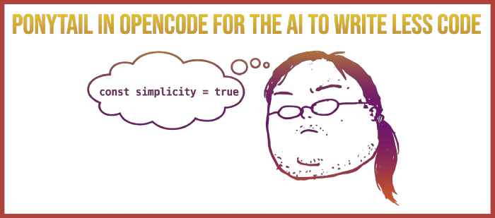

+++
title = "Ponytail in OpenCode: The Agent That Writes Less Code"
date = 2026-06-23
updated = 2026-06-23
description = "How to avoid over-engineering with a personality plugin for your AI agent"

[taxonomies]
tags = ["OpenCode", "AI", "plugins", "Tools"]

[extra]
footnote_backlinks = true
+++

## The problem: agents write too much

Example: "Email validator" → 500 lines, 3 packages, long comments.
They write a lot, but not always well.



## What is Ponytail

Ponytail is a personality plugin for your code agent.
It is not a new model. It is a set of rules and skills.
It teaches the agent to think like a "lazy senior developer": write one line and it works.

## How Ponytail works

The agent asks itself:

- Does the standard library already do this?
- Is there already a native function for this?
- Can an installed dependency solve this?
- Can I do it in one line?
- Do I really need this?

It prefers simplicity: less packages, less functions, less files.

## Benchmark results

- 80–94% less code.
- 47–77% less cost.
- 3–6x faster.
- Same model, same tests, same success rate.

## Who is Ponytail for

- Developers who want cleaner and cheaper code.
- Teams with over-engineering and unnecessary packages.
- Teachers who show how to ask: "do I really need this?".
- AI enthusiasts who want more "senior" agents.

### Ponytail commands and levels

**Commands:** `/ponytail`, `/ponytail-review`, `/ponytail-audit`, `/ponytail-debt`, `/ponytail-help`.

**Levels:** lite, full, ultra, off. Default: full.

## Practice walkthrough

1. Create a directory for the project and create `opencode.json` with just `{}`.
2. Open OpenCode and ask: _"Make me an email validator in JS that I can run with NodeJS"_.
3. See how many lines it writes and notice the unnecessary things.
4. Clone Ponytail:
   ```bash
   git clone https://github.com/DietrichGebert/ponytail.git
   ```
5. Add to `opencode.json`:
   ```json
   {
     "$schema": "https://opencode.ai/config.json",
     "plugin": ["../ponytail/.opencode/plugins/ponytail.mjs"]
   }
   ```
6. Open OpenCode and activate Ponytail: `/ponytail full`.
7. Ask: _"Create a JS script in a file called email-validator-ponytail.js to validate emails"_.
8. Notice how the code is shorter and stays focused on what you asked.
9. Try the audit: `/ponytail-audit` and fix the points you want.

## Video

In the following video you can see the complete process (Spanish audio).

{{ youtube_embed(video_id="sKBg7flMw8Y") }}
