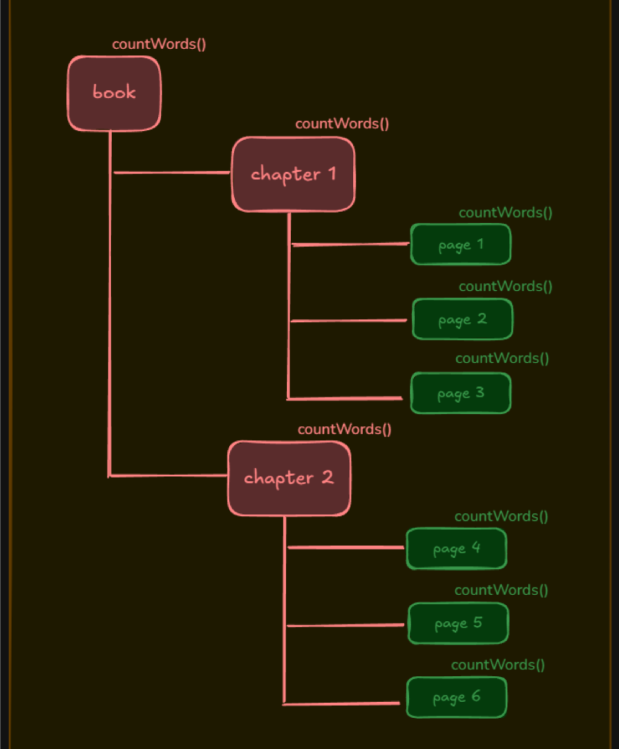
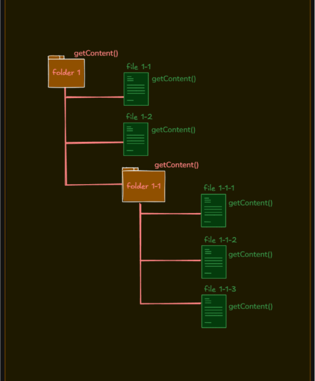
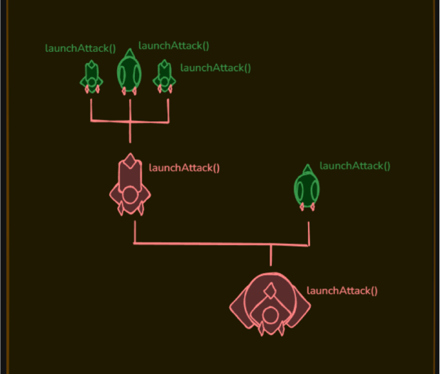
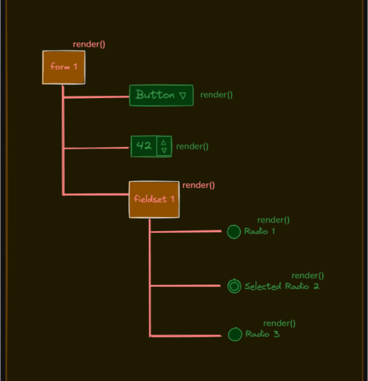

+++
title = "Composite pattern in PHP"
date = 2026-06-29
updated = 2026-06-29
description = "We practice the Composite pattern in PHP using a file system structure with directories and files as components"

[taxonomies]
tags = ["PHP", "OOP", "Design Patterns", "YouTube"]

[extra]
footnote_backlinks = true
+++

The Composite pattern lets you compose objects into uniform interface hierarchies. The power of this pattern is that both composite and leaf objects share a common method. When you call it on a composite object, it propagates through the entire hierarchy.


## Use cases

A book structure with chapters (composite elements) and pages (leaf elements). You have a common method `countWords()` on both types. If you call it on a chapter, it counts words throughout its hierarchy.



Another use case is a file system with directories and files and a common method `display()`. If you call it on a directory, it shows its name and the names of its children.



Another example could be a game with spaceships (leaf elements) and coordinator ships (composite elements). Both have a method `launchAttack()`. If you call it on a coordinator ship, it launches an attack from itself and its children.



An HTML form is also a good example. You have simple elements like buttons or inputs and composite elements like fieldsets. A `render()` method on a root form node renders the root and its children.



## Example: file system structure

We define a `FileSystemComponent` interface with a `display()` method. `File` is the leaf class. `Directory` is the composite class that can have children.

We create instances of leaf and composite objects, add leaves to composites, and display the whole hierarchy by calling `display()` on the root composite.

### The interface: FileSystemComponent

```php
<?php

interface FileSystemComponent {
    public function display();
}

?>
```

### Leaf class: File

```php
<?php

class File implements FileSystemComponent {
    private $name;

    public function __construct($name) {
        $this->name = $name;
    }

    public function display() {
        echo "File: " . $this->name . "\n";
    }
}

?>
```

### Composite class: Directory

```php
<?php

class Directory implements FileSystemComponent {
    private $name;
    private $children = array();

    public function __construct($name) {
        $this->name = $name;
    }

    public function add(FileSystemComponent $component) {
        $this->children[] = $component;
    }

    public function display() {
        echo "Directory: " . $this->name . "\n";
        foreach ($this->children as $child) {
            $child->display();
        }
    }
}

?>
```

### The client code

```php
<?php

$file1 = new File("file1.txt");
$file2 = new File("file2.txt");

$dir1 = new Directory("Folder 1");
$dir1->add($file1);
$dir1->add($file2);

$file3 = new File("file3.txt");

$root = new Directory("Root");
$root->add($dir1);
$root->add($file3);

$root->display();

?>
```

When you run this code, you get:

```
Directory: Root
Directory: Folder 1
File: file1.txt
File: file2.txt
File: file3.txt
```

## Video

In the following video you can see the complete process (Spanish audio).

{{ youtube_embed(video_id="sKBg7flMw8Y") }}
