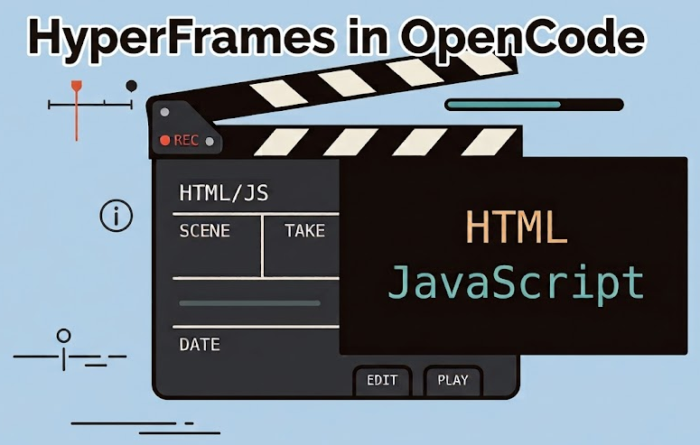

+++
title = "Creating videos with HyperFrames"
date = 2026-07-05
updated = 2026-07-05
description = "How to create videos using HTML and GSAP with the HyperFrames CLI tool"

[taxonomies]
tags = ["OpenCode", "Tools", "YouTube"]

[extra]
footnote_backlinks = true
+++

HyperFrames is like Remotion, but uses plain HTML instead of React. Chrome captures each frame, FFmpeg joins them, and you get an MP4 file. You control timing with `data-*` attributes and animations with JavaScript (GSAP JavaScript library).



Requirements: Node.js and FFmpeg in your PATH.

## First practice

In an empty directory run:

```bash
npx hyperframes init .
```

Choose the "blank" template and install the skills when asked. A browser opens with a video editor.

In the HTML section add:

```html
<div
  id="title"
  class="clip"
  data-start="0"
  data-duration="5"
  data-track-index="1"
  style="font-size: 64px; color: #fff; padding: 40px"
>
  Welcome to HyperFrames
</div>
```

In the JavaScript section add:

```js
tl.from('#title', { opacity: 0, y: -50, duration: 1 }, 0)
```

The timeline works like a theater play:

- **HTML**: the script (when each actor enters and leaves the stage)
- **JavaScript**: the choreography (how the actor moves while on stage)

## Using OpenCode to modify the video

Open OpenCode and ask:

> Using /hyperframes, modify index.html: I want two texts, "Welcome to" and "HyperFrames". "Welcome to" enters from the top and "HyperFrames" enters from the bottom, both moving to the center with a large font-size (100-120px), with a nice transition (ease, scale, or bounce). The animation lasts about 2 seconds and the text stays visible for the remaining 10 seconds.

The agent puts both texts inside one container clip (title-group) and animates each one individually with GSAP. The layout uses `flex-direction: column` so the spans stack vertically and meet in the center.

To export: click the Export button in the top-right corner, choose 1920x1080 at 60 fps.

## Second practice

Place SVG files in the `assets` directory and ask OpenCode:

> Using /hyperframes, create a 16-second video with 3 scenes...

Each scene uses icons and text with different GSAP animations. The final scene includes a counter that animates from 0 to 32300 with a power ease.

You can export the result as an MP4 file, full HD at 60 fps. To reopen the editor later, run:

```bash
npm run dev
```

## Video

In the following video you can see the complete process (Spanish audio).

{{ youtube_embed(video_id="jYawp25fCzc") }}
