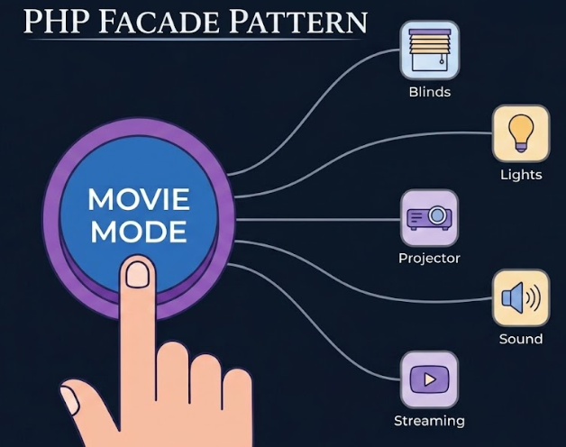

+++
title = "Facade pattern in PHP"
date = 2026-07-11
updated = 2026-07-11
description = "We practice the Facade pattern in PHP using a home automation example to simplify complex subsystem interactions into a single, clean interface"

[taxonomies]
tags = ["PHP", "OOP", "Design Patterns", "YouTube"]

[extra]
footnote_backlinks = true
+++

Hello developer 👋 In this video we practice the Facade pattern in PHP. This pattern lets us hide the complexity of a subsystem so the client code stays simple and elegant ✨



We apply it to an example of playing movies in a smart home. You just instantiate the facade and call one of its methods, and it takes care of the rest.

## The problem

Imagine you have a home automation system with many subsystems: lights, projector, sound system, blinds, and so on. Each subsystem has its own API with different methods. Playing a movie means calling methods on each subsystem in the right order.

Without a facade, the client code needs to know all the details of every subsystem.

## What the facade does

The Facade pattern simplifies access to something that already works but is complicated to use. It sits between the client and the subsystems, providing a simple interface.

```php
class HomeTheaterFacade
{
    private Lights $lights;
    private Projector $projector;
    private SoundSystem $sound;
    private Blinds $blinds;

    public function __construct()
    {
        $this->lights = new Lights();
        $this->projector = new Projector();
        $this->sound = new SoundSystem();
        $this->blinds = new Blinds();
    }

    public function playMovie(string $movie): void
    {
        $this->blinds->close();
        $this->lights->dim(10);
        $this->projector->on();
        $this->projector->setInput("hdmi");
        $this->sound->on();
        $this->sound->setVolume(20);
        echo "Playing movie: {$movie}\n";
    }

    public function endMovie(): void
    {
        $this->sound->off();
        $this->projector->off();
        $this->lights->dim(100);
        $this->blinds->open();
        echo "Movie ended.\n";
    }
}
```

The client code becomes very simple:

```php
$facade = new HomeTheaterFacade();
$facade->playMovie("Inception");
$facade->endMovie();
```

## Facade vs Adapter

Unlike the Adapter pattern, Facade does not adapt anything. It only simplifies access to something that already works. It does not add new functionality and does not modify the subsystems. It just coordinates them.

## Rules to keep in mind

- A facade should not contain too much logic like conditionals or calculations
- Facades coordinate, they do not replace the subsystems
- Each subsystem can still be used directly if needed

You can see the complete process in [this video](https://www.youtube.com/watch?v=f26nHhPrYm4) (Spanish audio).

{{ youtube_embed(video_id="f26nHhPrYm4") }}
