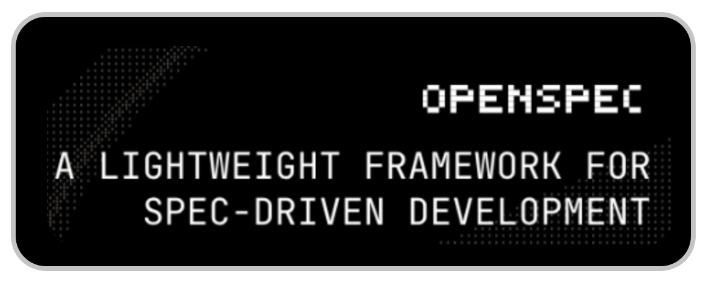

+++
title = "OpenSpec workflow with OpenCode"
date = 2026-07-18
updated = 2026-07-18
description = "I explore Spec-Driven Development with OpenSpec and OpenCode, a practical workflow to plan just enough before coding without falling into heavy documentation"

[taxonomies]
tags = ["OpenCode", "AI", "YouTube", "OpenSpec"]

[extra]
footnote_backlinks = true
+++

Hello developer 👋 In this post I explore Spec-Driven Development (SDD) with [OpenSpec](https://openspec.dev/) and [OpenCode](https://github.com/anomalyco/opencode). It is a way of working designed to plan just enough before writing code, without creating a huge planning phase like in Waterfall.



## What is OpenSpec

OpenSpec is a tool that brings structure to AI-assisted development. It works both for new projects and for existing systems where you already have code. The idea is simple: first explore, then propose, then apply, and finally archive the change.

You can find the source code on [GitHub](https://github.com/Fission-AI/OpenSpec/).

## The workflow

The default path looks like this:

```
/opsx:explore → /opsx:propose → /opsx:apply → /opsx:sync → /opsx:archive
```

Each step has a clear purpose:

- **explore** - Understand what you want to build. You talk with the AI until you are clear on the goal.
- **propose** - Ask the AI to create the spec artifacts. Then review the generated markdown files carefully.
- **apply** - Ask the AI to implement the tasks from the spec.
- **sync** - Merge the delta specs into the main specs so the documentation stays up to date.
- **archive** - Record the completed change.

If you are not sure what to build, use `explore` before `propose`. If you already know, you can start directly with `propose`.

## Directory structure

OpenSpec uses two main directories inside `openspec/`:

- `specs/` - The source of truth. It describes how the system currently behaves.
- `changes/` - Proposed modifications. Each change has its own folder with related artifacts. When a change is completed, it merges into the `specs/` directory.

The delta specs are a key concept. They let you see what has changed compared to the current specs.

## Getting started

You need Node.js 20.19.0 or higher. Install OpenSpec globally:

```bash
pnpm add -g @fission-ai/openspec@latest
```

Inside your project directory, run:

```bash
openspec init
```

To set it up for OpenCode:

```bash
openspec init --tools opencode
```

## When to use sync

The sync step merges your change specs into the main project specs. It makes sense when:

- The change is long and you want other parallel tasks to see the updated spec.
- You finished the implementation and want to leave the project clean before archiving.
- For small changes, `/opsx:archive` usually handles it for you.

## Conclusion

OpenSpec combined with OpenCode makes Spec-Driven Development practical. The workflow gives you a clear path from the initial idea to the final implementation, keeping documentation aligned with the code along the way.

You can see the complete process in the following video (Spanish audio).

{{ youtube_embed(video_id="7wXyjt5MZw0") }}
