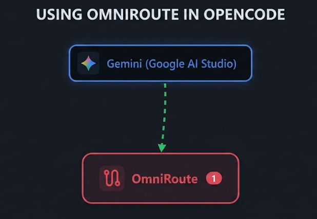

+++
title = "OmniRoute with OpenCode"
date = 2026-07-25
updated = 2026-07-25
description = "How to set up OmniRoute, a free and open source local gateway that connects your editor or CLI to more than 90 AI providers with free tiers"

[taxonomies]
tags = ["OpenCode", "AI", "Tools", "YouTube"]

[extra]
footnote_backlinks = true
+++

Hello developer 👋 In this post we look at [OmniRoute](https://github.com/diegosouzapw/OmniRoute), a free and open source local gateway that connects your editor or CLI with more than 90 AI providers that offer free tiers. When one provider runs out of quota, OmniRoute switches automatically to the next one.



## What is OmniRoute

OmniRoute is a single endpoint that sits between your tool (like OpenCode) and the AI providers. Instead of configuring each provider separately, you point everything to `localhost` and OmniRoute handles the rest.

## Installing OmniRoute

You can install it globally with npm or pnpm:

```bash
npm install -g omniroute
```

Or with pnpm:

```bash
pnpm add -g omniroute@latest --allow-build=better-sqlite3 --allow-build=@swc/core
```

After installing, run the command:

```bash
omniroute
```

## First launch

When you run OmniRoute for the first time it asks you to create a password. Then it starts a local server and opens a dashboard in the browser.

If you see an "Internal Server Error" in the browser, stop the server, rename the `.omniroute` directory in your home folder (for example to `.omniroute-bkp`), and run `omniroute` again. This forces it to regenerate the SQLite database.

Once it is running, you get an access point like `http://localhost:20128/api/v1`.

## Setting up Gemini

1. Go to the Google AI website and create an API key.
2. In OmniRoute, select Gemini and paste the API key.
3. Enable the check for free models.
4. Go to **Endpoints** on the left menu and copy the API route: `http://localhost:20128/v1`.
5. Go to **API Manager** and generate a new key. Name it `opencode` and leave the rest of the values as they are.

## Configuring OpenCode

Create an `opencode.json` file in the root of your project with the following configuration. Replace the `apiKey` value with the key you generated in OmniRoute:

```json
{
  "$schema": "https://opencode.ai/config.json",
  "provider": {
    "omniroute": {
      "npm": "@ai-sdk/openai-compatible",
      "name": "OmniRoute",
      "options": {
        "baseURL": "http://localhost:20128/v1",
        "apiKey": "sk-ea327cb1ba696fc5-30dfc2-35e5894b"
      },
      "models": {
        "gemini/gemini-3.5-flash": {
          "name": "Gemini-3.5-flash (free, via OmniRoute)"
        }
      }
    }
  }
}
```

## Testing it out

Open OpenCode, run `/models`, and select the Gemini model you just created. Then try a prompt and you should see the response come through OmniRoute.

## Conclusion

OmniRoute is a convenient way to access multiple AI providers from a single local endpoint without paying for API credits. Combined with OpenCode, it lets you test and use free models directly from your development environment.

## Video

In the following video you can see the complete process (Spanish audio).

{{ youtube_embed(video_id="n0Tm_BxYKng") }}
