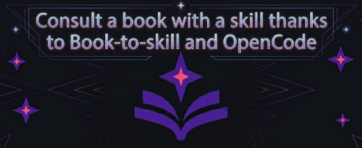

+++
title = "Book to skill with OpenCode"
date = 2026-08-07
updated = 2026-08-07
description = "I try book-to-skill, an open source tool that turns a technical book into a skill your AI agent can consult on demand, using far fewer tokens than pasting the whole book"

[taxonomies]
tags = ["OpenCode", "Tools", "AI", "YouTube"]

[extra]
footnote_backlinks = true
+++

Hello developer 👋 In this post I try [book-to-skill](https://github.com/virgiliojr94/book-to-skill), an open source tool that solves a very common problem: you read a technical book and, months later, you do not remember what a specific chapter said. Asking an AI does not help much: either it hallucinates, or it costs a fortune in tokens if you paste the whole book.



## What is book-to-skill

book-to-skill converts a book into a kind of "study card" that an AI agent can consult on demand, loading only what it needs at each moment. This means up to 24 or 50 times fewer tokens than pasting the complete book.

Today we are going to test it with OpenCode, the AI agent tool we have been using on this blog.

## Getting the book

For the practice we are going to use [Think Python 2e](https://greenteapress.com/wp/think-python-2e/), a free book. It is available under the Creative Commons Attribution-NonCommercial 3.0 Unported license, which means you can copy, distribute and modify it freely, as long as you credit the work and do not use it for commercial purposes.

Be careful: if you use a book you bought and it has a different license, do not share what you generate with this tool, because you would be distributing protected material. You can still use it locally and privately for yourself.

## Installing the skill

Follow the official documentation and clone the skill into your global skills directory so it is available everywhere:

```bash
git clone https://github.com/virgiliojr94/book-to-skill.git ~/.claude/skills/book-to-skill
```

Then verify the extraction tools:

```bash
python3 ~/.claude/skills/book-to-skill/scripts/extract.py --check
```

Since the book is a PDF, the check confirms the tool can process it. There are sections for other formats like EPUB or DOCX, but we do not need them right now.

## Analyzing the book

Open OpenCode and run:

```
/skills
```

Then run the skill with the path to the book:

```
/book-to-skill path/to/think-python-2e.pdf
```

When it asks you for the book type, choose option 1 (Technical). It is a programming book with code blocks, so it will keep the code format correctly.

Note: if you do not have docling installed, it uses the fallback method (pdftotext). It works the same, just with slightly lower quality in tables and complex code.

The tool shows you an estimate for processing the book. I pressed "analyze only" to preview the result first.

## Generating the skill

Since I was using a free model, I did not process the whole book at once and generated only a part. book-to-skill has a mode called "fold-in" that lets you add new chapters to an existing skill, session by session, without spending extra tokens or losing what you already generated. You can build your knowledge base at your own pace.

With the analysis done (19 chapters), I asked for the first 7 chapters plus SKILL.md and left the rest for future sessions.

To resume another day, you run the skill again pointing to the folder already created and indicating which chapters are missing:

```
/book-to-skill thinkpython2.pdf ~/.claude/skills/think-python
```

The skill is created in the user home path, so it is available globally.

## Using the skill

Once it finished, I closed OpenCode and opened it again. Now the skill is available:

```
/skills
```

I can see `/think-python` there, so I can test it in "Plan" mode to consult something:

```
/think-python recursion
```

It responds with real content from the chapter, citing the exact source, not a generic hallucination. And this query cost a few thousand tokens, far from the 108,000 it would cost to read the whole book every time.

## Conclusion

book-to-skill turns the books you read into a reusable knowledge base that your AI agent can consult cheaply and accurately. Combined with the fold-in mode, you can grow it chapter by chapter at your own pace and forget about hallucinated answers or huge token bills.

## Video

In the following video you can see the complete process (Spanish audio).

{{ youtube_embed(video_id="e1PzdLoSjW8") }}
