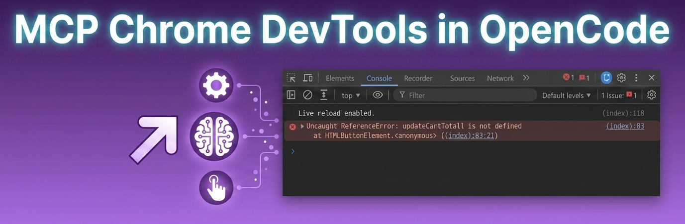

+++
title = "Chrome DevTools MCP with OpenCode"
date = 2026-08-13
updated = 2026-08-13
description = "How to set up Chrome DevTools MCP in OpenCode and use it to debug a real page: the AI opens Chrome, clicks the button, reads the console and fixes the error itself"

[taxonomies]
tags = ["OpenCode", "MCP", "Tools", "AI", "YouTube"]

[extra]
footnote_backlinks = true
+++

Hello developer 👋 Have you ever had a web page with a button that does not work and you do not know why? In this post we try [Chrome DevTools MCP](https://github.com/ChromeDevTools/chrome-devtools-mcp), an open source project that gives AI agents access to Chrome DevTools. We configure it in OpenCode and apply it to a real debugging case: a cart button that does not respond.



## What is Chrome DevTools MCP

Chrome DevTools MCP lets your AI agent drive a real Chrome browser. The key difference: the AI does not guess the code. It opens Chrome, clicks the button, reads the console and finds the error. And it does not stop there: it fixes the bug and tests the button again to confirm everything works.

## The example

The example is a web page with a cart button that does not work. Instead of looking at the code blindly, we let the AI use a real Chrome browser to find the problem.

Looking at `index.html` we see the bug: it is a typo. The call should be `updateCartTotal()`, not `updateCartTotall(cartTotal)`.

We open `index.html` with `pnpm dlx live-server` in the Zed terminal and click the "Add to cart" button on the page. It does not work.

## Configuring the MCP

On the GitHub page we search for "OpenCode" with Ctrl+F and create the JSON file. The documentation suggests creating it globally, which makes sense to use it in multiple projects: `~/.config/opencode/opencode.json`. For this practice I created an `opencode.json` only for the project.

The documentation gives the code for npm, but in OpenCode I use it with pnpm:

```json
{
  "$schema": "https://opencode.ai/config.json",
  "mcp": {
    "chrome-devtools": {
      "type": "local",
      "command": ["pnpm", "dlx", "chrome-devtools-mcp@latest"]
    }
  }
}
```

Then we open OpenCode and verify that the MCP is loaded. There is usually a command or panel to see the connected MCP servers. If you type `/mcps` you can see the available MCPs.

## Using it in Plan mode

With `index.html` running on Live Server, we write the prompt in Plan mode:

```
Use the chrome-devtools MCP and open http://127.0.0.1:5500/index.html, click the 'Add to cart' button and tell me why the cart does not work.
```

## How it works

Why does a Chrome window open? The MCP launches a real Chrome instance (not headless by default) so it can interact with the actual page. That is why you see the window open with `new_page`.

About the snapshot, here is the important nuance: `take_snapshot` is not a screenshot. It is a snapshot of the accessibility/DOM tree of the page: a text representation of all the elements (buttons, text, inputs) with a unique id (`uid`) for each one. That is why it does not generate any image file.

Look at the sequence:

- `take_snapshot` gets the list of elements, including the button with `uid=1_4`.
- `click [uid=1_4]` uses that exact identifier to click, without x/y coordinates and without "looking" at an image.

This is what the repository calls "reliable automation": instead of the AI trying to guess where a button is in a screenshot (fragile and imprecise), it interacts directly with the real DOM structure. If you want a literal image, there is a different tool: `take_screenshot`.

The rest of the sequence, in short:

- `evaluate_script` reads the real HTML/JS of the page to locate the typo in the code.
- `list_console_messages` confirms the error exactly as the browser throws it (a `ReferenceError`), not a guess.

This contrast between `take_snapshot` and `take_screenshot` shows why this tool is more reliable than an agent that only "looks" at screenshots.

## Fixing the error in Build mode

Now we write the prompt in Build mode:

```
Yes, fix it and test the button again to confirm that the cart updates.
```

And you can see how it checks the final results by testing the button again.

## Conclusion

That is the key difference: it does not just tell you what is wrong, it really verifies it, opening the browser, clicking and reading the console. Chrome DevTools MCP turns your AI into someone who debugs the way you would, not someone who guesses the code.

## Video

In the following video you can see the complete process (Spanish audio).

{{ youtube_embed(video_id="jOvlDgLXuJI") }}
