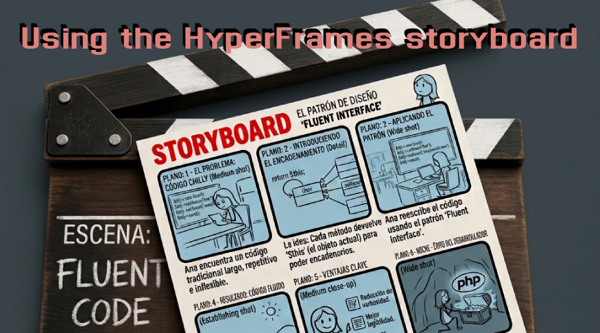

+++
title = "HyperFrames storyboard practice."
date = 2026-08-25
updated = 2026-08-25
description = "How to use the HyperFrames storyboard feature with OpenCode to plan a video before generating the final result with animations and effects."

[taxonomies]
tags = ["OpenCode", "HyperFrames", "Tools", "AI", "YouTube"]

[extra]
footnote_backlinks = true
+++

Hello developer 👋 In this post we practice with the storyboard feature of HyperFrames. We use HyperFrames and OpenCode to create a storyboard before generating the final video, defining its frames and adding comments to make modifications. Then we create the sketches and run the final build with the effects and movements of each frame.



## Starting materials

In an empty directory I have the following starting data:

- A base material as a sequence of what we want to show, saved as `SCRIPT.md`.
- Some images that I want to be created, saved in `img/`.

## Installing HyperFrames

Install HyperFrames with the following command:

```bash
npx hyperframes init .
```

When it asks that the project already contains files, tell it to overwrite. In the installation wizard, choose the "blank" project example.

HyperFrames will open in the web browser. Go to the storyboard tab where you will find a prompt to generate `STORYBOARD.md` in the project root.

## Generating the storyboard

I created a temporary file `tmp-prompt.txt` where I pasted the prompt and also added that the base material for creating the storyboard can be found in `SCRIPT.md`.

Then I opened a large terminal in the Zed code editor, launched OpenCode, and asked a free model (Big Pickle from the free OpenCode Zen models) to process what is inside `tmp-prompt.txt`:

```
Realiza @tmp-prompt.txt
```

## Building the video

Next, in OpenCode, I asked the AI to process `STORYBOARD.md` with HyperFrames:

```
Usando /hyperframes, construye el vídeo a partir de STORYBOARD.md, usando SCRIPT.md como fuente del contenido exacto (código, comentarios, citas) para cada frame.
```

## The three steps

In a first step we are asked to review the storyboard and add comments if we want to modify something. After that, we can generate some sketches, which are an approximation of the final result but without animations or effects. Finally, we generate the final result with the animations and effects.

## Video

In the following video you can see the complete process (Spanish audio).

{{ youtube_embed(video_id="0FSa_SOFGbY") }}
