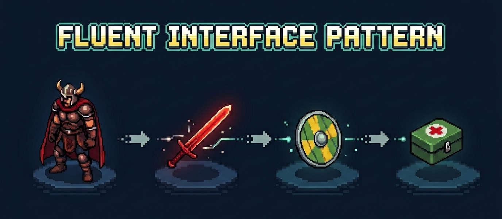

+++
title = "Fluent Interface Pattern in PHP."
date = 2026-09-06
updated = 2026-09-06
description = "We practice the Fluent Interface technique in PHP to write code that reads like natural language by chaining method calls."

[taxonomies]
tags = ["PHP", "OOP", "Design Patterns", "YouTube"]

[extra]
footnote_backlinks = true
+++



## Let's practice

In the repository where we are practicing design patterns, I created a new directory called "Techniques" for this type of technique that is not part of the official catalog.

Let's imagine we are developing a roguelike game where we instantiate our hero named Darian:

```php
$hero = new Character('Darian');
```

Now our hero walks over a tile with several items, and as they step on it we equip a sword, heal them, and level them up:

```php
$hero->equip('Fire Sword');
$hero->heal(20);
$hero->levelUp();
```

This works, but notice how many times you repeat `$hero->`. What if we could write this as a phrase that reads like natural language?

```php
$hero->equip('Fire Sword')->heal(20)->levelUp();
```

It's as if we were saying "Darian equips a fire sword, heals, and levels up."

This is called a Fluent Interface, a design style where each method returns the object itself (`$this`), so you can chain calls together.

The secret is a single `return $this;` at the end of each method.

The code reads almost like a sentence in natural language, instead of a list of separate instructions.

Here's the `Character` class:

```php
class Character
{
    private int $health = 100;
    private int $level = 1;
    private array $inventory = [];

    public function __construct(private string $name) {}

    public function equip(string $item): self
    {
        $this->inventory[] = $item;
        return $this;
    }

    public function heal(int $points): self
    {
        $this->health = min(100, $this->health + $points);
        return $this;
    }

    public function levelUp(): self
    {
        $this->level++;
        return $this;
    }

    public function status(): string
    {
        return "{$this->name} (Lv.{$this->level}, {$this->health} HP) - inventory: " . implode(', ', $this->inventory);
    }
}
```

And here's the client code that uses the class:

```php
$hero = new Character('Darian');
$hero->equip('Fire Sword')->heal(20)->levelUp();
echo $hero->status();
```

## Final note

Martin Fowler and Eric Evans popularized the term Fluent Interface back in 2005. Today we can see it in APIs of classes, libraries, and frameworks like jQuery:

```javascript
$('#aviso').addClass('notification').fadeIn(300).hide()
```

Each method returns an object that allows continuing with the next operation, making the code read more fluidly.

Be careful because there is a similar pattern that also uses this method chaining but with a different goal: the Builder Pattern. We'll leave that for a future video.

In the following video you can see the complete process (Spanish audio).

{{ youtube_embed(video_id="OXxyPvL9HIY") }}
