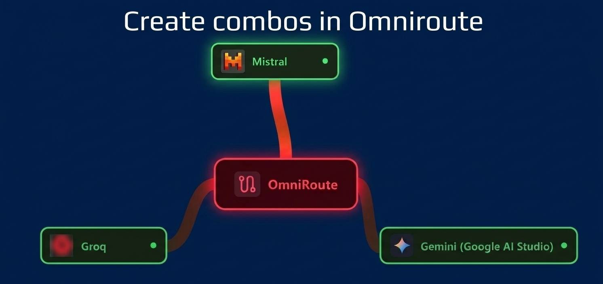

+++
title = "Creating combos in OmniRoute."
date = 2026-09-13
updated = 2026-09-13
description = "How to create a combo in OmniRoute with multiple free models from Groq, Gemini, and Mistral so that if one fails, the gateway automatically routes to another."

[taxonomies]
tags = ["OmniRoute", "AI", "Tools", "YouTube"]

[extra]
footnote_backlinks = true
+++

In this video we test OmniRoute Combos: we create one with several free models from Groq, Gemini, and Mistral so that if one fails, the gateway automatically redirects to another.



## Introduction

Have you ever run out of a free model quota in the middle of work and had to switch providers manually?

In this video we test OmniRoute Combos: we create one with several free models from Groq, Gemini, and Mistral so that if one fails, the gateway automatically redirects to another.

## Practice

### Installing OmniRoute

```bash
pnpm add -g omniroute@latest --allow-build=better-sqlite3 --allow-build=@swc/core
```

After installing, I noticed I'm using v3.8.50.

After logging in with the default password, go to the Security section and change the password. Then copy the Endpoint URL and generate an API Key from OmniRoute.

### Adding providers

I add the Groq provider by generating an API key on the Groq website, importing the free models into OmniRoute, and testing them with the OmniRoute test button.

Now create the combo "myfreecombo" in OmniRoute and add the two free Groq models in the "steps" step.

Do the same with Gemini and Mistral.

### Configuring Zed

Finally, in Zed, configure the new provider of type "OpenAI" (in LLM Providers) → Add provider (top right) → OpenAI, keeping tools and chat_completions active (the defaults) and lowering the tokens:

```json
"max_tokens": 128000,
"max_output_tokens": 4096,
"max_completion_tokens": 4096
```

**max_tokens**: This is for Zed's internal use only, it does not travel in the request. It tells Zed how large the context window is, and Zed uses it to calculate remaining context and decide when to warn about "Context Too Large" or trigger automatic compaction.

**max_output_tokens**: Also for Zed's internal use, it does not travel in the request. How much of the total window to reserve for the response before even sending the request.

**max_completion_tokens**: This value does travel in the request and expresses the same as max_output_tokens: the maximum number of tokens the model can generate in its response.

The rule is: set the value of the model with the **smallest** window in the entire OmniRoute chain, not the largest.

These values can be found in the provider/model documentation:

| Provider          | Context    | Max output |
| ----------------- | ---------- | ---------- |
| Groq (120B/20B)   | 131,072    | 65,536     |
| Gemini 2.5 Flash  | ~1,000,000 | 65,536     |
| Mistral Codestral | 128,000    | 4,096      |

You need to configure Zed with the most restrictive values across the entire chain, which are now Codestral's values.

## Video

In the following video you can see the complete process (Spanish audio).

{{ youtube_embed(video_id="GqDHUbVCb_g") }}
