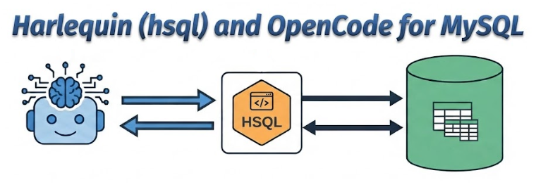

+++
title = "Harlequin SQL IDE with OpenCode."
date = 2026-10-04
updated = 2026-10-04
description = "How to install Harlequin, a free SQL IDE for the terminal, connect it to a local MySQL database and use it from OpenCode with the hsql skill."

[taxonomies]
tags = ["OpenCode", "SQL", "Tools", "AI", "YouTube"]

[extra]
footnote_backlinks = true
+++

Hello developer 👋! In this post we try [Harlequin](https://github.com/tconbeer/harlequin), a free and open source SQL IDE for the terminal. It also includes the HSQL tool and a skill that we can use with our AI agents.

We test it with OpenCode against a MySQL database that we create locally. Remember that the AI can be wrong, so use it carefully (for example, only locally).



## What is Harlequin

Harlequin is a SQL editor that runs inside your terminal. It gives you a proper editor with tabs, keyboard shortcuts and three panels: the query editor, the query results and the data catalog.

The interesting part for us is that it also installs a command called `hsql`, and `hsql` can generate a skill for AI agents. That skill teaches the agent how to read the catalog and write safe queries, so OpenCode can work with your database instead of guessing.

We are going to use it carefully against a local database in a development environment, never in production. That way, if the agent makes a mistake such as a DELETE without a WHERE clause, we do not lose anything important. Before starting, I made a backup of the local database.

## Installation

Install it with `uv` as a tool:

```bash
uv tool install "harlequin[mysql]"
```

We install it as a tool because that puts Harlequin in its own isolated environment and adds it to your PATH, so you can run it from anywhere. This is the right option for Harlequin, because what we want is the `harlequin` command (and `hsql`), not to import it from Python code.

## Connecting to MySQL

1. Open XAMPP and start MySQL.
2. Open a terminal (I use Alacritty).
3. Connect with:

```bash
harlequin -a mysql -h localhost -p 3306 -U root
```

The `-a` flag is for adapter, and `-U root` is the user. In my case there is no password.

## Moving around Harlequin

Harlequin has three zones, and you move between them with these keys:

- `F2`: query editor.
- `F5`: query results.
- `F6`: data catalog.

Inside the query editor:

- `Ctrl+N` opens a new tab.
- `Ctrl+W` closes a tab.
- `Ctrl+Enter` runs the query.

The author says he based the shortcuts on VSCode, so if you use VSCode the keys feel familiar.

## Creating the example database

Now we create a small library database. In Harlequin you can run each block separately:

```sql
CREATE DATABASE biblioteca;
```

```sql
CREATE TABLE biblioteca.autores (
  id INT AUTO_INCREMENT PRIMARY KEY,
  nombre VARCHAR(100),
  pais VARCHAR(50)
);
```

```sql
CREATE TABLE biblioteca.libros (
  id INT AUTO_INCREMENT PRIMARY KEY,
  titulo VARCHAR(150),
  anio INT,
  autor_id INT,
  FOREIGN KEY (autor_id) REFERENCES biblioteca.autores(id)
);
```

```sql
CREATE TABLE biblioteca.socios (
  id INT AUTO_INCREMENT PRIMARY KEY,
  nombre VARCHAR(100),
  email VARCHAR(100)
);
```

```sql
CREATE TABLE biblioteca.prestamos (
  id INT AUTO_INCREMENT PRIMARY KEY,
  libro_id INT,
  socio_id INT,
  fecha_prestamo DATE,
  fecha_devolucion DATE NULL,
  FOREIGN KEY (libro_id) REFERENCES biblioteca.libros(id),
  FOREIGN KEY (socio_id) REFERENCES biblioteca.socios(id)
);
```

Now we have four tables with their foreign keys: `autores`, `libros`, `socios` and `prestamos`.

## Installing the skill for OpenCode

Create an empty directory for the practice:

```bash
mkdir harlequin-test
```

From a Git Bash terminal inside Zed, install the skill into the project so OpenCode can use it. I install it locally for this project only:

```bash
hsql --skill -o .opencode/skills/hsql/
```

Then I start git and make a first commit (`first commit`). It is not necessary, but I like to do it so I can see easily if a file changes or something new is created.

## Using it with OpenCode

Now we open OpenCode and write this prompt:

```
Use the hsql skill to connect to my local MySQL (XAMPP: host localhost, port 3306, user root, no password, mysql adapter).

Work ONLY on the `biblioteca` database; do not touch any other.

1. Read the catalog of `biblioteca` to see the tables that already exist (autores, libros, socios, prestamos).
2. Insert consistent sample data: 10 authors, 25 books, 8 members and 15 loans (some already returned and some not).
3. Respect the foreign keys and do not delete or modify existing data.
4. Before running the INSERTs, show me the statements and wait for my confirmation.
5. When you finish, verify with a SELECT COUNT(*) per table.
6. If you need to write a .sql file, you can write it in this project.
```

Two details in this prompt are important. The first one is point 4: the agent has to show the statements and wait, so nothing runs without your approval. The second one is the transaction: the agent may ask if you want to run everything as a transaction, and you should say yes. With a transaction, either all the inserts go in or none of them do.

## Conclusion

Harlequin is a small but complete SQL editor for the terminal, and the interesting part is the `hsql` skill: with a few lines of prompt, the agent reads your catalog, respects your foreign keys and asks for permission before writing anything. Use it on a local or development database, make a backup, and let the agent show you the statements first.

## Video

In the following video you can see the complete process (Spanish audio).

{{ youtube_embed(video_id="Ds-wZIXCTl4") }}
