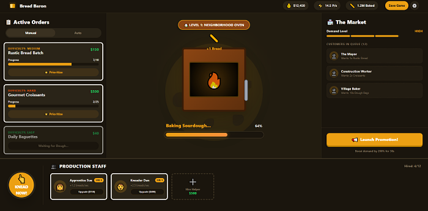

+++
title = "Bread Baron"
description = "Bread Baron is a clicker-style game that lets you build your bread empire and become a tycoon of the baking world."
weight = 50

[extra]
local_image = "projects/breadbaron/logo.png"
+++

**Bread Baron** is a clicker-style game that lets you build your bread empire and become a tycoon of the baking world.

#### [GitHub](https://github.com/darellanodev/bread-baron)

## Technologies

    
    
    
    
    
    
    

## Main Features

- **Run in web**: This game can be played in a modern web browser.
