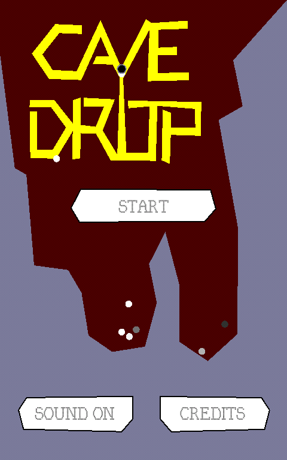
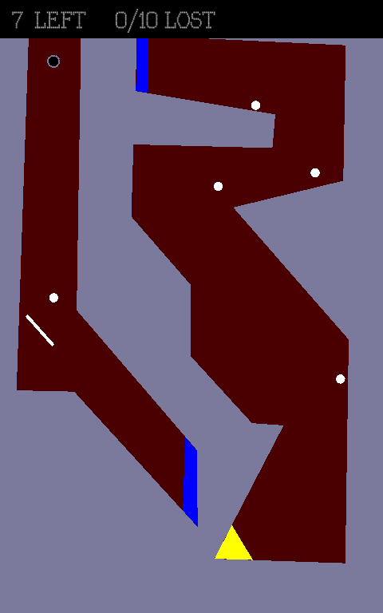
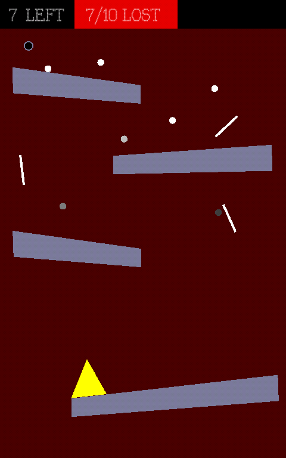

+++
title = "Cave drop"
description = "This is a game I developed for desktop and mobile android devices using Processing. "
weight = 90

[extra]
local_image = "projects/cavedrop/logo.png"
+++

**Cave drop** is a game I developed for desktop and mobile android devices using Processing.

#### Technologies

    
    

## Main Features

- **Play in android mobile**: This is a game that can be played in an android mobile device.
- **Phisics**: Uses phisics.

## Development Best Practices

- **OOP**: Using Oriented Object paradigm style.
- **Documentation**: Documenting tasks.
