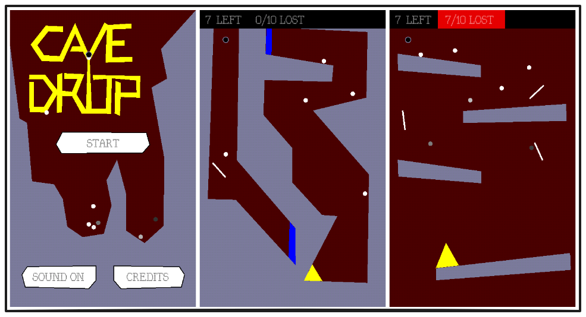

+++
title = "Cave drop"
description = "A 2D physics-based game built with Processing."
weight = 90

[extra]
local_image = "projects/cavedrop/logo.png"
category = "Games"
+++

**Cave Drop** is a 2D physics-based game I developed for desktop and Android mobile devices using Processing.

## Technologies

    
    

