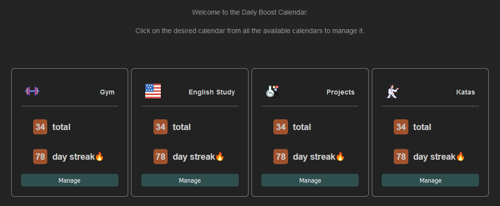
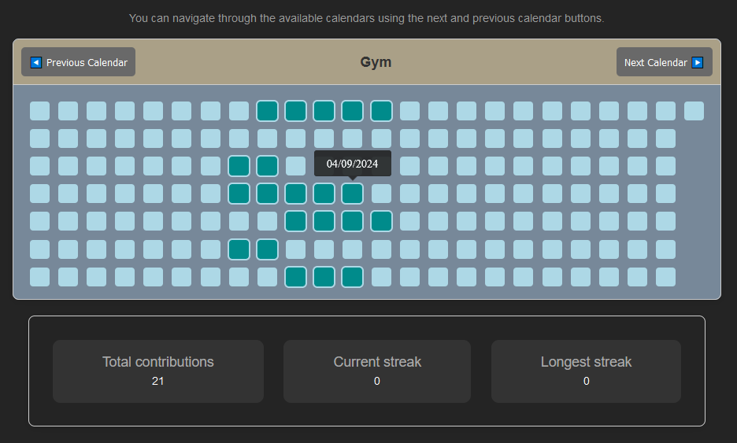

+++
title = "Daily Boost Calendar"
description = "An easy calendar like the github's contributions calendar for learning purposes."
weight = 30

[extra]
local_image = "projects/dailyboostcalendar/logo.png"
+++

**Daily Boost Calendar** is an easy calendar like the github's contributions calendar made in React.

#### [GitHub](https://github.com/darellanodev/daily-boost-calendar) {.centered-text}

## Technologies

    
    
    
    
    
    
    
    

## Main Features

- **Use in web**: This is an application that can be used in a modern web browser.

## Development Best Practices

- **Unit testing**: Uses Jest for unit testing.
- **TDD**: Made with TDD when its possible.
- **OOP**: Using Oriented Object paradigm style.
- **Documentation**: Documenting tasks.
