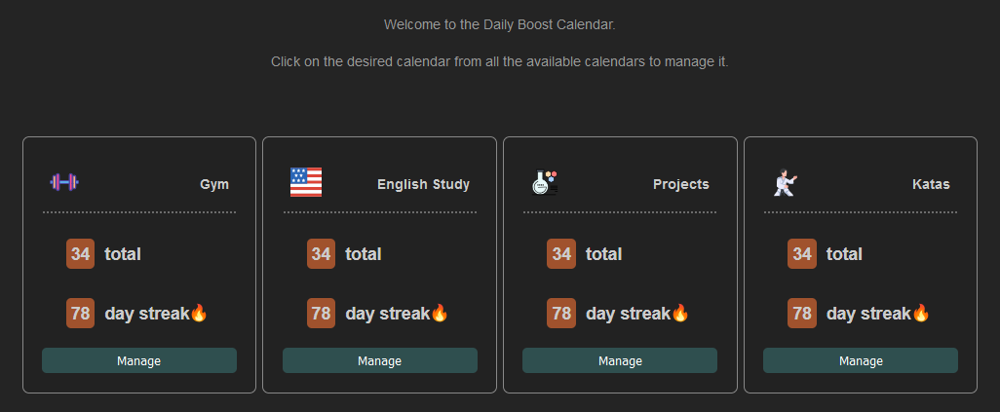
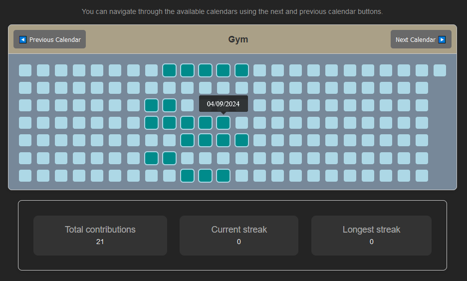

+++
title = "Daily Boost Calendar"
description = "Track your habits with GitHub-style calendars and stats."
weight = 20

[extra]
local_image = "projects/dailyboostcalendar/logo.png"
category = "Management"
+++

**Daily Boost Calendar** is a simple calendar inspired by GitHub's contributions calendar, built with React. Create calendars for the habits you want to build, log your daily progress, and use the statistics to keep yourself motivated.

#### [GitHub](https://github.com/darellanodev/daily-boost-calendar) • [Try it online](../../tryitonline/dailyboostcalendar/index.html) {.centered-text}

## Technologies

    
    
    
    
    
    
    
    

