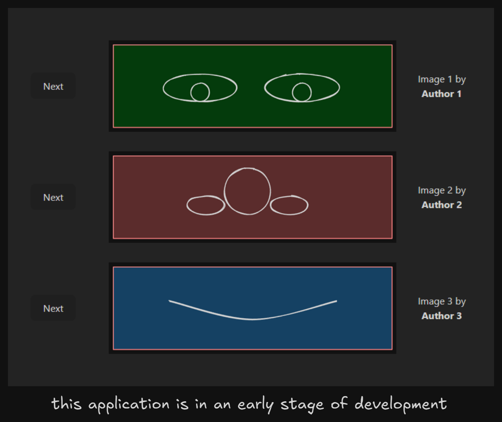

+++
title = "Face Toon Maker"
description = "This is a web app to customize a toon face, for learning purposes and practice TDD with React."
weight = 54

[extra]
local_image = "projects/facetoonmaker/logo.png"
+++

**Face Toon Maker** is a web app to customize a toon face, for learning purposes and practice TDD with React.

#### [GitHub](https://github.com/darellanodev/face-toon-maker) • [Try it online](https://darellanodev.github.io/face-toon-maker/) {.centered-text}

## Technologies

    
    
    
    
    

## Main Features

- **Run in web**: This app can be open in a modern web browser.

## Development Best Practices

- **TDD**: Made with TDD.
