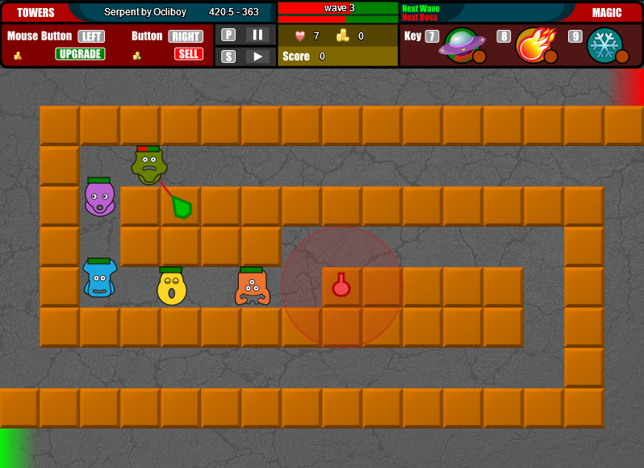
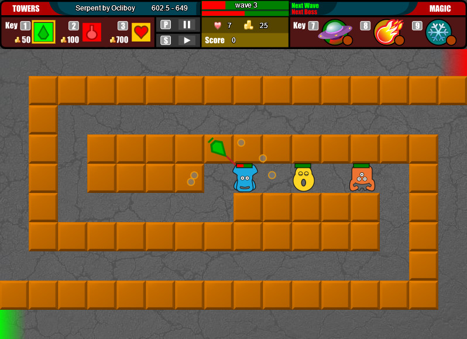

+++
title = "Gif Tower Defense"
description = "Rewritting my old 2012 game with the same name, now using p5js and Typescript."
weight = 10

[extra]
local_image = "projects/giftowerdefense/logo.png"
+++

**Gif Tower Defense** is an attempt to rewrite my old game with the same name created in 2012 with processingjs now using p5.js and Typescript, for fun and learning purposes.

#### [GitHub](https://github.com/darellanodev/gif-tower-defense) • [Play online](../../playablegames/giftowerdefense/index.html) {.centered-text}

#### Made with [Typescript](https://www.typescriptlang.org/) | [p5js](https://p5js.org/) | [InkScape](https://www.inkscape.org/)

## Main Features

- **Play in web**: This is a game that can be played in a modern web browser.
- **Level editor**: The player can make their own levels.

## Development Best Practices

- **Unit testing**: Uses Jest to make unit testing.
- **TDD**: Made with TDD when its possible.
- **OOP**: Using Oriented Object paradigm style.
- **Documentation**: Documenting tasks.
