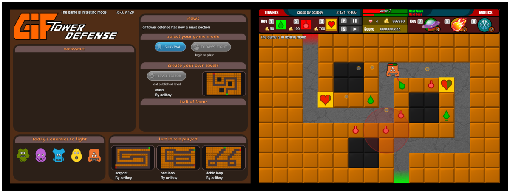

+++
title = "Gif Tower Defense"
description = "A rewrite of my old 2012 game, now using p5.js and TypeScript."
weight = 10

[extra]
local_image = "projects/giftowerdefense/logo.png"
+++

**Gif Tower Defense** is a remake of my old game with the same name, originally made in 2012 with Processing.js. Now I’m rebuilding it with p5.js and TypeScript for fun and learning.

#### [GitHub](https://github.com/darellanodev/gif-tower-defense) • [Try it online](../../tryitonline/giftowerdefense/index.html) {.centered-text}

## Technologies

    
    
    
    
    
    

