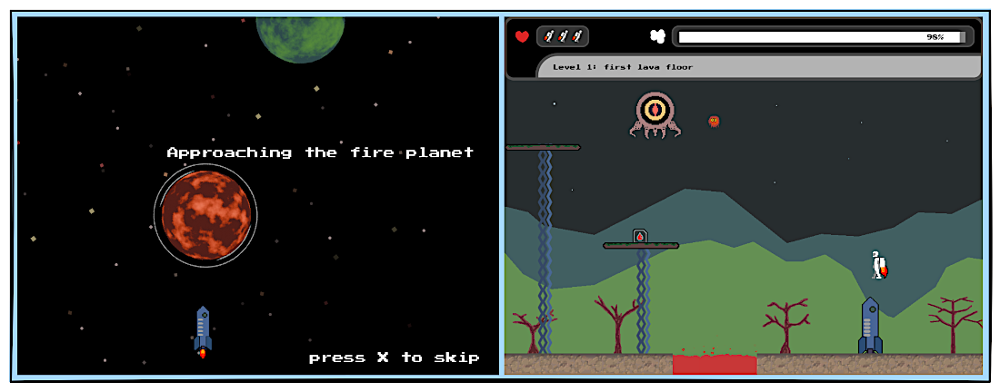

+++
title = "Jetpack"
description = "A simple game to learn Go and Ebitengine, for desktop and web."
weight = 20

[extra]
local_image = "projects/jetpack/logo.png"
+++

**Jetpack** is a simple game to learn Go and Ebitengine, for desktop (Windows) and web.

#### [GitHub](https://github.com/darellanodev/jetpack-game) • [Try it online](../../playablegames/jetpack/index.html) {.centered-text}

## Technologies

    
    
    
    
    
    

## Main Features

- **Play desktop (Windows)**: This is a game that can be played in desktop (Windows).
- **Play in web**: This is a game that can be played in a modern web browser.
- **Level editor**: The player can make their own levels.

## Development Best Practices

- **Unit testing**: Uses Go testing capabilities to make unit testing.
- **TDD**: Made with TDD when its possible.
- **OOP**: Using Oriented Object paradigm style.
- **Documentation**: Documenting tasks.
