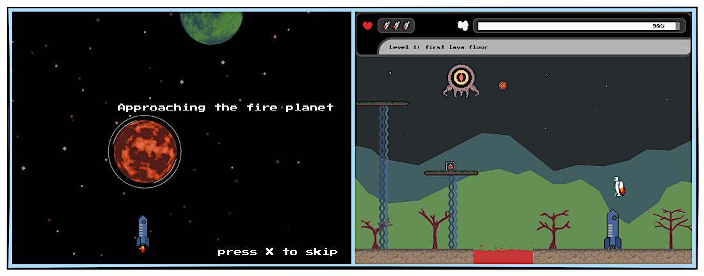

+++
title = "Jetpack"
description = "Fly between planets, collect fuel and dodge enemies."
weight = 20

[extra]
local_image = "projects/jetpack/logo.png"
category = "Games"
+++

**Jetpack** is a simple game built to learn Go and Ebitengine, for desktop (Windows) and web. Pilot an astronaut across planets, gather fuel to get back to the ship, and dodge the enemies that appear in every level.

#### [GitHub](https://github.com/darellanodev/jetpack-game) • [Try it online](../../tryitonline/jetpack/index.html) {.centered-text}

## Technologies

    
    
    
    
    
    

