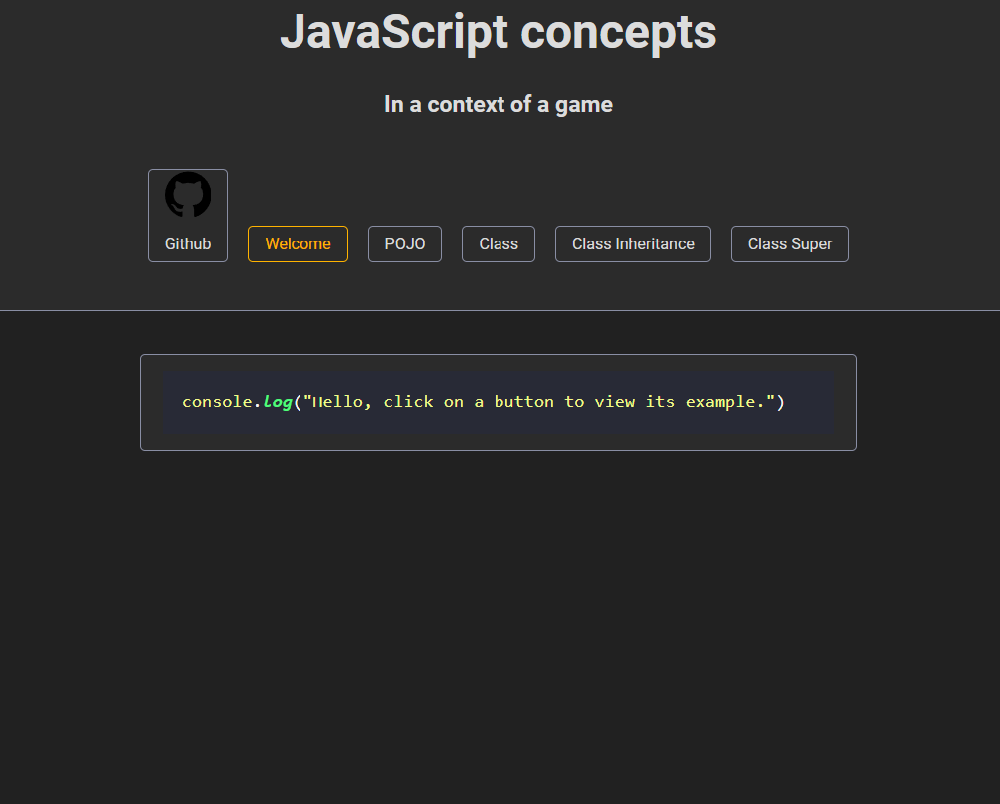
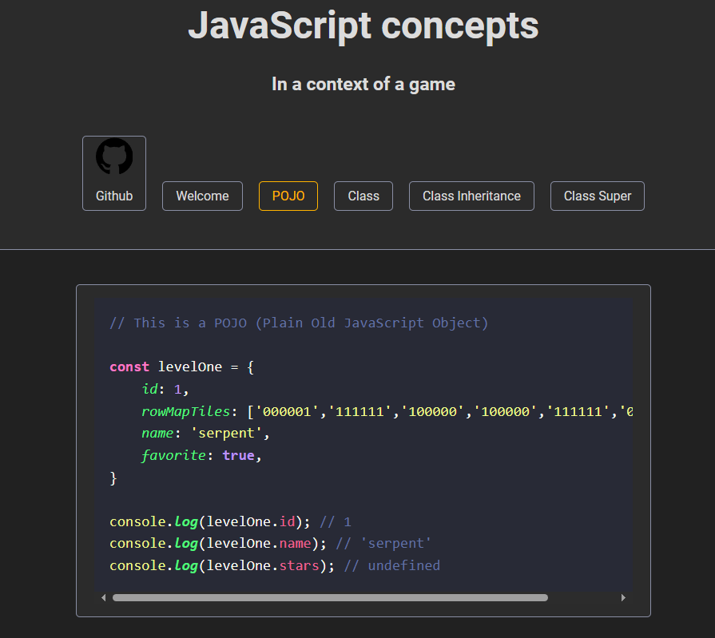

+++
title = "JavaScript concepts"
description = "A simple app to summarize concepts of the JavaScript language in the context of a game"
weight = 60

[extra]
local_image = "projects/jsconcepts/logo.png"
+++

**JS Concepts** A simple app to summarize concepts of the JavaScript language in the context of a game.

#### [GitHub](https://github.com/darellanodev/js-concepts) • [Try online](../../playablegames/jsconcepts/index.html) {.centered-text}

## Technologies

    
    
    
    

#### Made with Made with [HTML](https://developer.mozilla.org/en-US/docs/Web/HTML) | [CSS](https://developer.mozilla.org/en-US/docs/Web/CSS) | [JavaScript](https://developer.mozilla.org/en-US/docs/Web/JavaScript)
