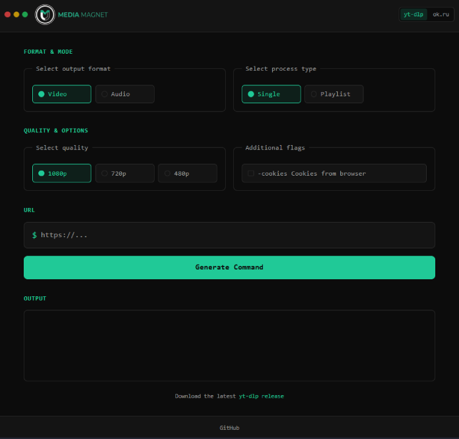

+++
title = "Media Magnet"
description = "A multi-tool GUI for video and audio downloads"
weight = 40

[extra]
local_image = "projects/mediamagnet/logo.png"
+++

**Media Magnet** is a simple graphical user interface (GUI) for the yt-dlp application and other tools for learning purposes.

#### [GitHub](https://github.com/darellanodev/media-magnet) • [Try it online](https://darellanodev.github.io/media-magnet/) {.centered-text}

## Technologies

    
    
    
    
    

## Main Features

- **Web application**: This is a web application that can be used in web browsers.
