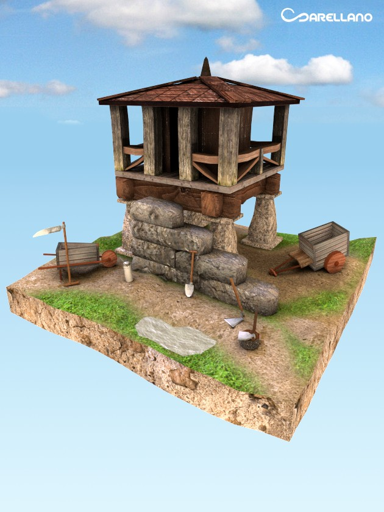
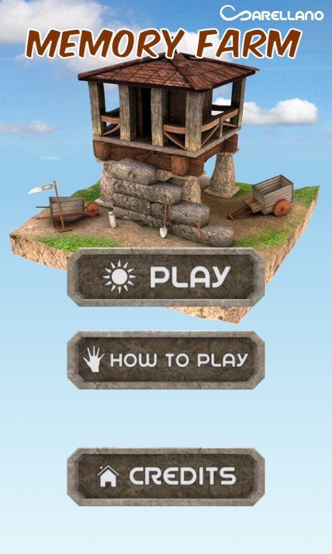
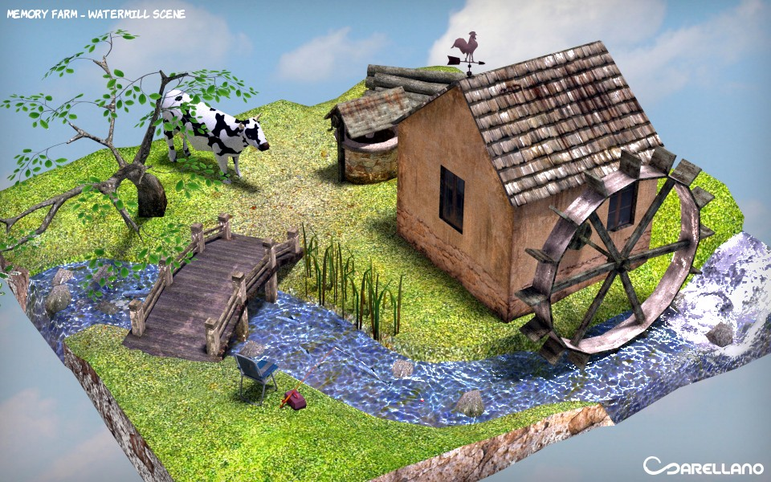
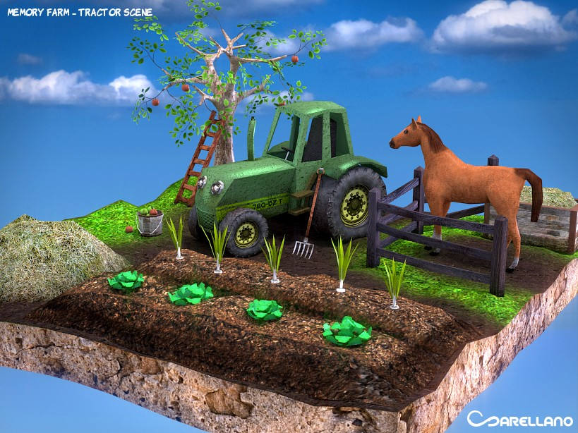

+++
title = "Memory farm"
description = "Spot the missing object in rural 3d scenes."
weight = 70

[extra]
local_image = "projects/memoryfarm/logo.png"
category = "Games"
+++

**Memory Farm** is a game I developed for Android using augmented reality, built with Unity3D and a library for marker recognition. Explore rural scenes, memorize every element, and then spot which object has disappeared.

## Technologies

    
    
    

