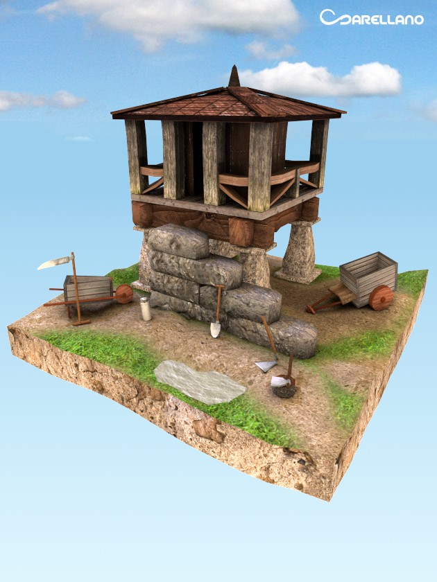

+++
title = "Memory farm"
description = "This is a game I developed for mobile android devices using augmented reallity using Unity3d and a library for markers recognition."
weight = 50

[extra]
local_image = "projects/memoryfarm/logo.png"
+++

**Memory farm** is a game I developed for mobile android devices using augmented reallity using Unity3d and a library for markers recognition.

#### Made with [Unity3d](https://unity.com) | [Blender](https://www.blender.org) | [Gimp](https://www.gimp.org)

## Main Features

- **Play in android mobile**: This is a game that can be played in an android mobile device.
- **Augmented reality**: Uses augmented reality with 3d models.

## Development Best Practices

- **OOP**: Using Oriented Object paradigm style.
- **Documentation**: Documenting tasks.
