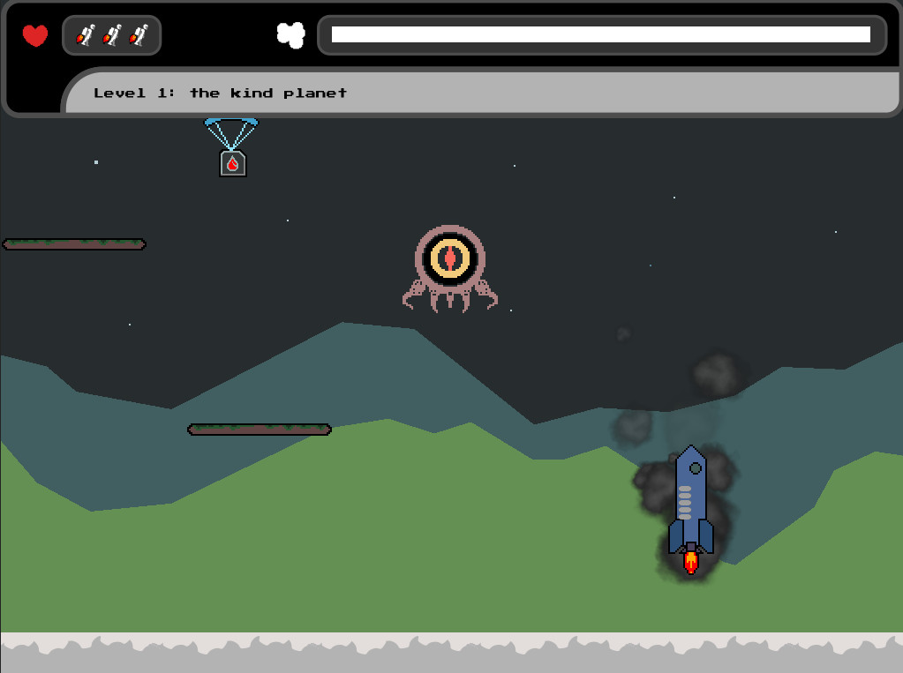

+++
title = "Mini Jetpack"
description = "A simple game to learn Go and Ebitengine, for desktop and web."
weight = 30

[extra]
local_image = "projects/minijetpack/logo.png"
+++

**Mini Jetpack** is a simple game to learn Go and Ebitengine, for desktop (Windows) and web.

#### [GitHub](https://github.com/darellanodev/gif-tower-defense) • [Play online](http://127.0.0.1:5500/playablegames/giftowerdefense/index.html) {.centered-text}

#### Made with [Golang](https://go.dev/) | [Ebitengine](https://ebitengine.org/) | [InkScape](https://www.inkscape.org/) | [Piskel](https://www.piskelapp.com/) | [Bfxr](https://www.bfxr.net/)

## Main Features

- **Play desktop (Windows)**: This is a game that can be played in desktop (Windows).
- **Play in web**: This is a game that can be played in a modern web browser.
- **Level editor**: The player can make their own levels.

## Development Best Practices

- **Unit testing**: Uses Go testing capabilities to make unit testing.
- **TDD**: Made with TDD when its possible.
- **OOP**: Using Oriented Object paradigm style.
- **Documentation**: Documenting tasks.
